# Challenge 05: Resilience Testing using Azure Load Testing & Azure Chaos Studio

## Introduction

This challenge centers around Azure Load Testing and Azure Chaos Studio, empowering you to perform performance tests and enhance application resilience. In the modern digital landscape, guaranteeing optimal performance during heavy loads and fortifying against disruptions is essential. Through Azure's tools, you'll gain insights into proactive issue detection and methods to reinforce your applications.

This is the solution guide that contains all of the comprehensive, step-by-step directions needed to finish the challenge.

## Solution Guide

## Task 1: Setting Up Azure Load Testing

In this task, you'll create an Azure Load Testing instance and run a test using a JMeter file.

1. In the Azure Portal, navigate to the **contosotraders-<inject key="DeploymentID" enableCopy="false" />** resource group and select the **Endpoint** resource with the name  **contoso-traders-ui2<inject key="DeploymentID" />**.

   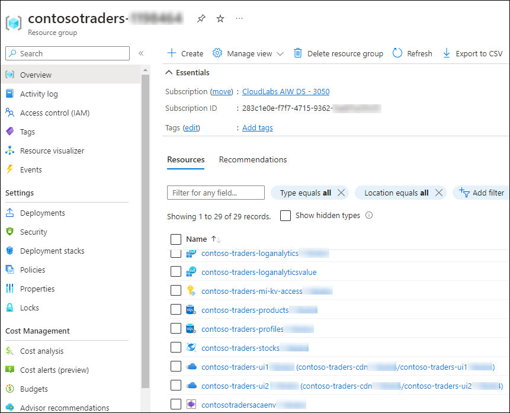

1. From the overview of the **contoso-traders-ui2<inject key="DeploymentID" enableCopy="false" />** endpoint, copy the **Endpoint hostname** **(2)** and paste it into the notepad for later use in the task.

   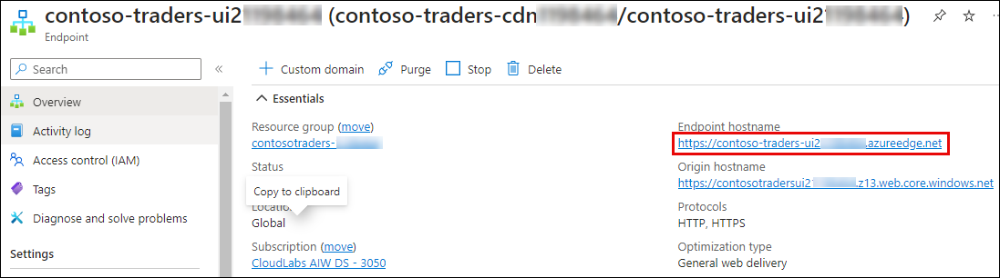

1. To create an Azure Load Testing service, within the global search bar of the Azure Portal, search for and select **Azure Load Testing**.

   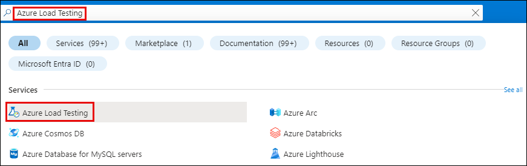

1. Click on **+ Create**.

   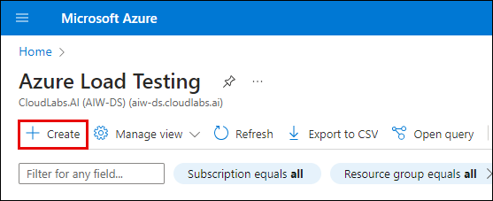

1. Within the **Basics** tab of the **Create a load testing resource**, enter the following details. Click on **Review + create**
   - **Subscription**: Select the available subscription provided **(1)**.
   - **Resource group**: Select **contosotraders-<inject key="DeploymentID" /> (2)**
   - **Name**: Enter **contoso-traders-loadtest-<inject key="DeploymentID" /> (3)**
   -  **Region**: **Same as your contoso webapp resource group deployment (4)**
   -  Click on **Review + create (5)**
   - Finally, click on **Create**.

      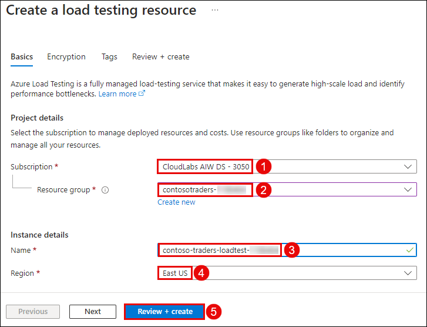

1. On the left-hand side pane, select **Tests** ***(1)***, and click on **+ Create** ***(2)***, and select **Create a URL-based test (3)**.

   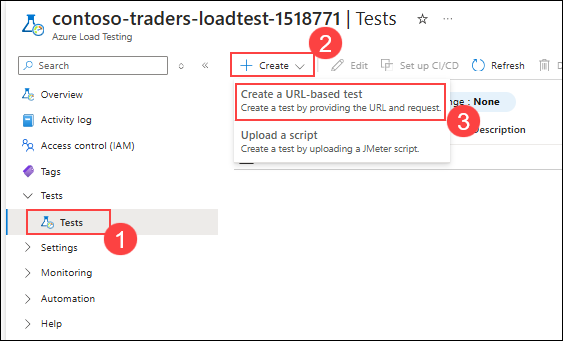

1. On the **Create a URL-based test** page, keep the default settings and select **Next**. 

   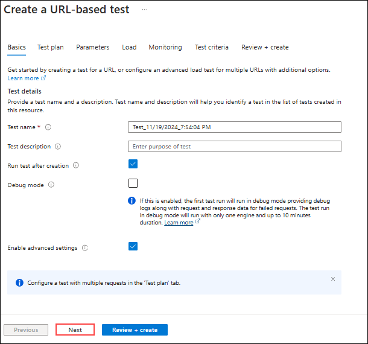

1. On the **Test plan** page, keep the default settings and select **+ Add request**. On the Add request tab, paste the **Endpoint URL** as URL that you have copied earlier. Click on **Add** and then on **Next**.

   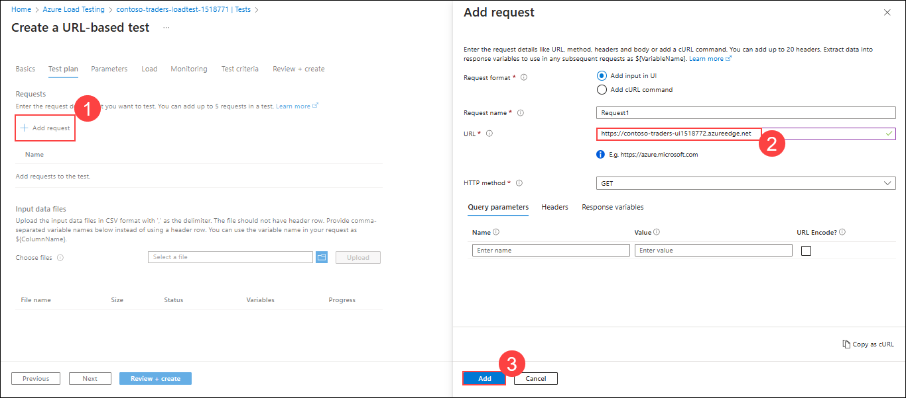

1. On the **Load** page, change the **Test duration** to **5 minutes** and rest keep the default settings and select **Review + create** , followed by **Create**.

   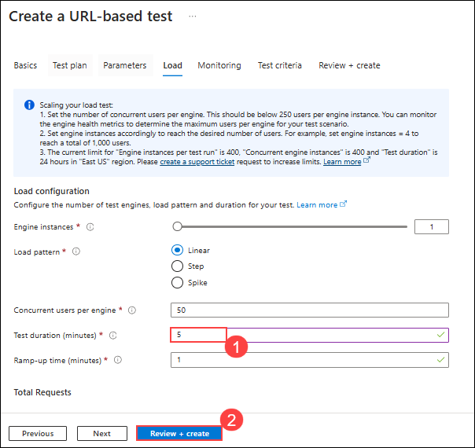


1. The test run will start, and once the test run is completed, you will be able to see the **Client-side metrics**. Explore the given metrics output.

   
   
   **Note**: In case the test fails due to `The test was stopped due to a high error rate, check your script and try again. If the issue persists, raise a ticket with a support error. This is expected, as sometimes the load on the application exceeds the defined throughput.
     
## Task 2: Create an experiment and target using Azure Chaos studio

In this task, your objective is to incorporate Targets and establish an Experiment within Azure Chaos Studio. This process aims to assess the resilience of the web application we developed by introducing real faults and observing how our applications react to real-world disruptions.

1. In the portal, open the **Azure Cloud Shell** by clicking on the icon in the top right of the Azure Portal.

    

1. The first time you start Cloud Shell you're prompted to which shell to use. Select, select **Bash**.

1. In the **Getting started** pane, select **No storage account required** for an ephemeral session. Using the dropdown menu, select the subscription you want to use for Cloud Shell, then select the **Apply** button.

   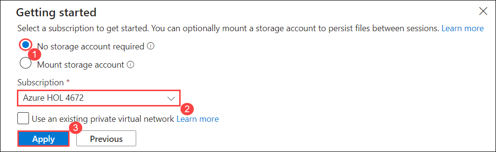

1. Run the following commands in an Azure Cloud Shell window where you have the active subscription set to be the subscription where your AKS cluster is deployed

   ```
   az aks get-credentials --admin --name <YourManagedClustername> --resource-group <YourManagedClusterresourcegroup>
   ```

   >**Note**: Replace <YourManagedClustername> and <YourManagedClusterresourcegroup> with the name of your cluster and resource group.

1. Switch back to **Powershell** by click on **Switch to Powershell**.

   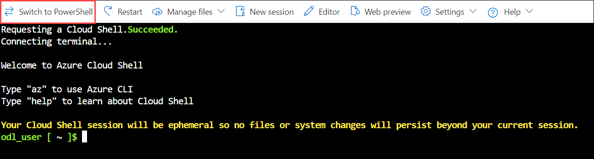

1. Run the below commands one-by-one.

   ```
   helm repo add chaos-mesh https://charts.chaos-mesh.org
   helm repo update
   kubectl create ns chaos-testing
   helm install chaos-mesh chaos-mesh/chaos-mesh --namespace=chaos-testing --set chaosDaemon.runtime=containerd --set chaosDaemon.socketPath=/run/containerd/containerd.sock
   ````

1. Verify that the Chaos Mesh pods are installed by running the following command:

   ```
   kubectl get po -n chaos-testing
   ```
1. You should see output similar to the following example (a chaos-controller-manager and one or more chaos-daemons):

   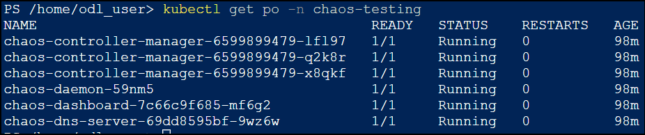

1. Verify that the application pods are running by executing the following command:  

   ```  
   kubectl get pods  
   ```  
   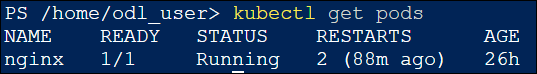
   
1. If no pods are visible, run the following command to create a new pod:
 
   ```
   kubectl run my-pod --image=nginx --restart=Never  
   ```
1. In the Azure Portal, search for **Azure Chaos Studio (1)** and then click on it from the search results **(2)**.
   
   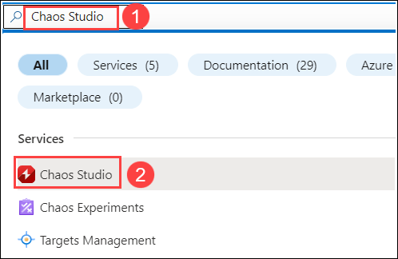

1. In the **Azure Chaos Studio**, select **Targets** on the left menu.

   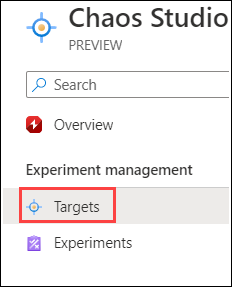
      
1. From the drop-down menu, select the **contosotraders-<inject key="DeploymentID" enableCopy="false" />** resource group.
 
   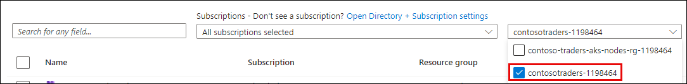
     
1. Click on the **contoso-traders-aks<inject key="DeploymentID" enableCopy="false" />** **(1)** **Kubernetes service** instance, and from the drop-down for **Enable Targets** **(2)**, choose **Enable service-direct targets (All resources)** **(3)**.

   
     
1. Click on **Review + Enable**.

   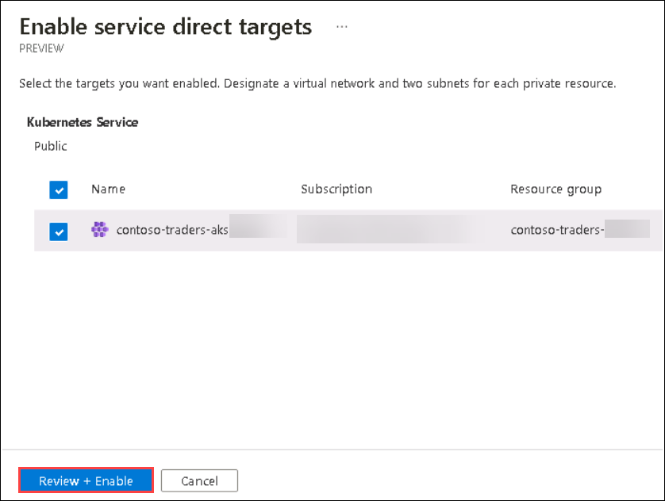

1. Then click on **Enable** to Enable service-direct targets. 
   
   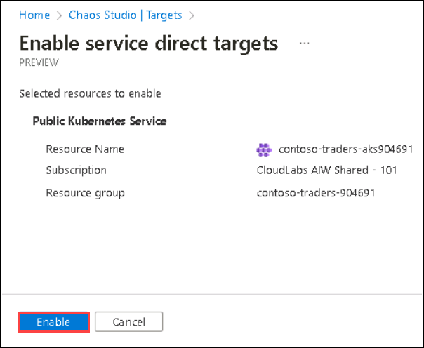

1. Wait for the deployment to be completed.  

1. In the Azure Portal search for **Azure Chaos Studio** ***(1)*** and then click on it from the search results ***(2)***.
   
   
    
1. Once the target is enabled, select **Experiments** ***(1)*** on the left, click the **+ Create** ***(2)*** drop-down, and select **New experiment** **(3)** .
 
   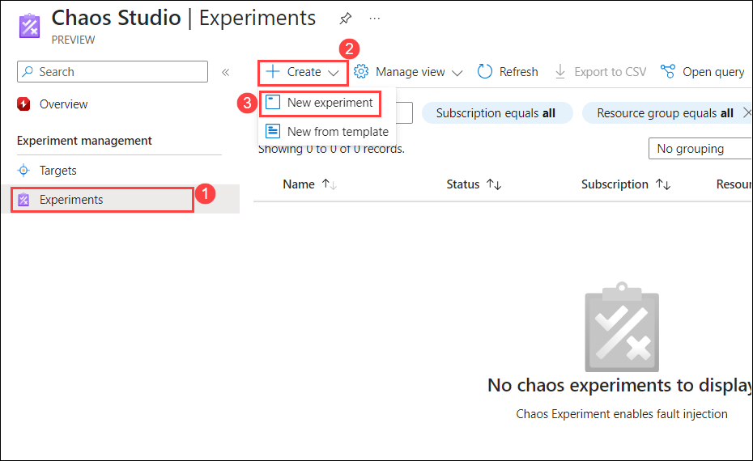
 
1. On the **Create an experiment** page, under the **Basics** tab, provide the following values and select **Next: Permissions >** ***(4)***.

    - Subscription: Select the default subscription ***(1)***
    - Resource Group: **contosotraders-<inject key="DeploymentID" enableCopy="false" />** ***(2)***
    - Name: **contoso-chaos-<inject key="DeploymentID" enableCopy="false" />** ***(3)***
    - Region: Leave it to default 
 
      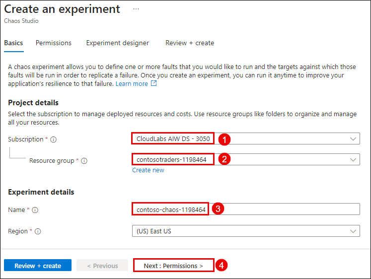
   
1. On the **Permissions** page, leave the default selection and select **Next: Experiment designer >**.

   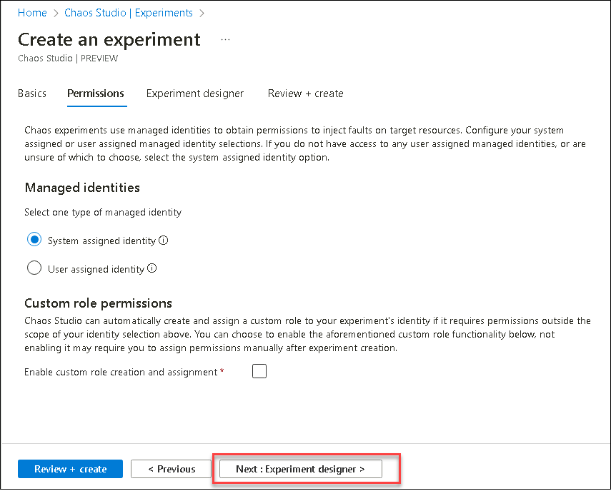
 
1. On the **Experiment designer** page select **+ Add action (1)** and choose **Add fault (2)**.

   
 
1. On the **Add fault** page, select the following and select **Next: Target resources>** **(4)**.
   
   - Faults: **AKS Chaos Mesh Pods Chaos (deprecated)** ***(1)***
   - Duration (minutes): **5** ***(2)***
   - jsonSpec: Leave it to default ***(3)***
     
      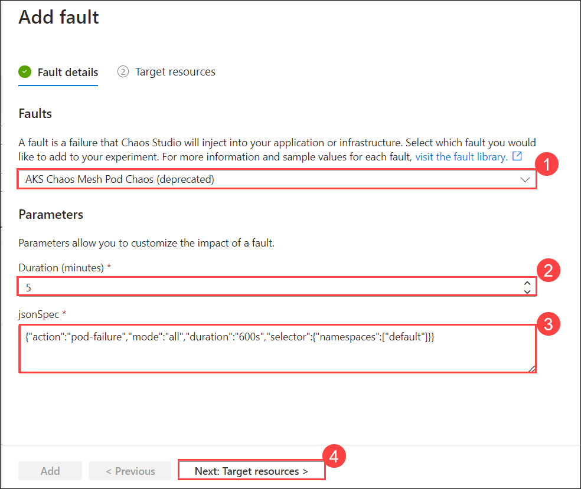
     
1. On **Target resources**, select **Manually select from a list** **(1)** option under the **Select target resources** , select the **contoso-traders-aks<inject key="DeploymentID" enableCopy="false" />** ***(2)*** resource, and **Add** ***(3)***.
  
   
  
1. Click on **Review + create**.
  
   
   
1. On the **Review + create** page, click on **Create**.
    
1. Navigate back to the **contoso-traders-aks<inject key="DeploymentID" enableCopy="false" />** container instance and select **Access control (IAM) (1)**, click on **+ Add (2)**, and select **Add role assignment (3)**. 
  
   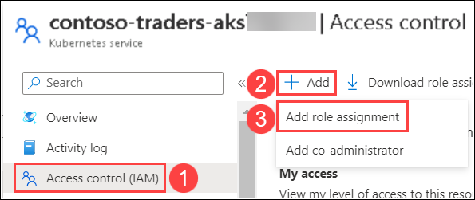
  
1. In the **Add role assignment** page, under the **Role** tab, select **Privileged administrator roles**. Select **Owner (1)** and then **Next (2)**.
  
   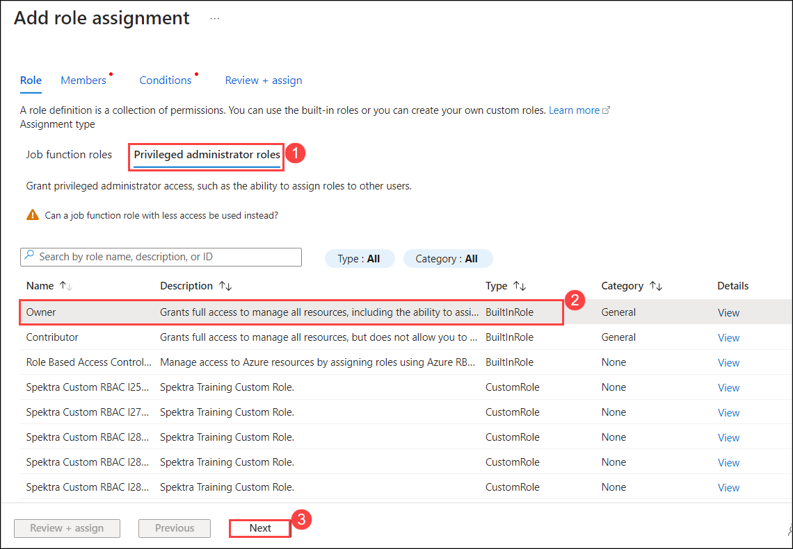
  
1. Next, on the **Members** tab, select **Managed identity (1)**  for **Assign access to** , click on **+ Select members (2)**  on the **Select managed identities** choose **Chaos Experiment (3)** for **Managed identity**, select the experiment **contoso-chaos-<inject key="DeploymentID" enableCopy="false" /> (4)**, click on **Select (5)**, and click on **Next** **(6)**.  
   
   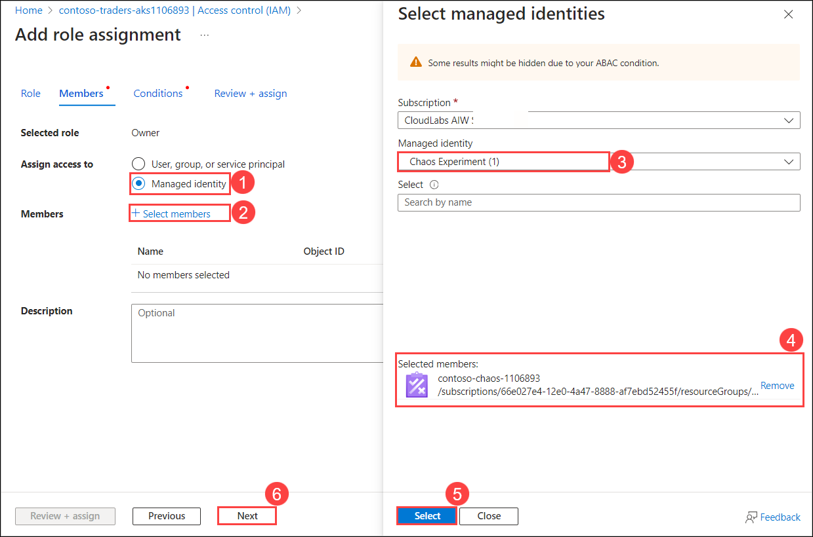
  
1. Next, on the **Conditions** tab, select **What user can do** as **Allow user to assign all roles** **(1)** and click on **Review + assign** **(2)**.

   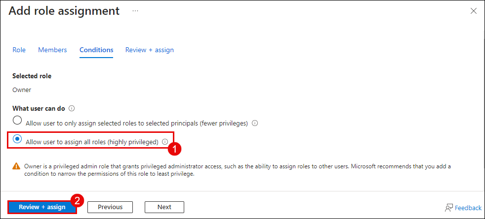

1. Click on **Review + assign**. 
   
   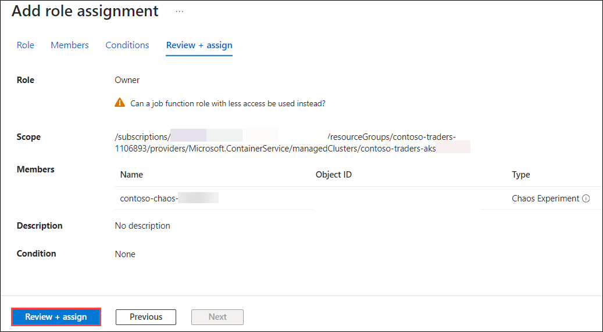
      
1. On the Azure Portal, navigate back to the Chaos experiment you created, **contoso-chaos-<inject key="DeploymentID" enableCopy="false" />** and click on **Start**.
  
   
 
1. Select **Ok** to **Start this experiment** pop-up.

    
       
1. Once the experiment status is **Success** click on **Details** to view the run preview.
 
   
 
1. On the **Details** preview page, select **Action (1)** and view the complete details of the run on **Fault details** under **Successful targets (2)**.
 
   

## Success criteria:
To complete this challenge successfully:

- Successful integration of Azure Monitor and Application Insights within the application environment, ensuring seamless data collection and monitoring capabilities.
- Selection and configuration of key performance metrics relevant to the application's functionality and performance goals.
- Establishment of effective alerting mechanisms with well-defined thresholds, ensuring timely notifications for potential issues or deviations in monitored metrics.

## Additional Resources:

- Refer to [Continuous validation with Azure Load Testing and Azure Chaos Studio](https://learn.microsoft.com/en-us/azure/architecture/guide/testing/mission-critical-deployment-testing) for reference.
- [What is Azure Chaos Studio?](https://learn.microsoft.com/en-us/azure/chaos-studio/chaos-studio-overview).
- [Load test a website by using a JMeter script in Azure Load Testing](https://learn.microsoft.com/en-us/azure/load-testing/how-to-create-and-run-load-test-with-jmeter-script?tabs=portal).
- [Intro to Chaos Engineering and Azure Chaos Studio](https://pdtit.medium.com/intro-to-chaos-engineering-and-azure-chaos-studio-preview-5e85fff10642).
