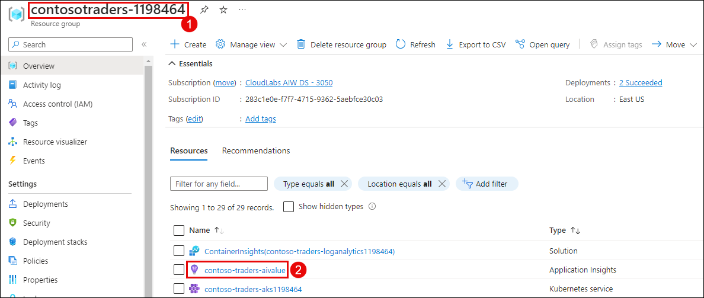
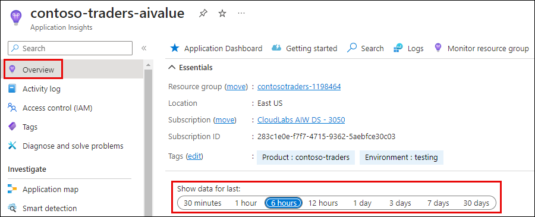

# Challenge 05: Implementing Monitoring Solutions for Contoso Traders

### Estimated Time: 60 minutes

## Introduction

In this challenge, the user/attendee will integrate Azure's monitoring tools—Azure Monitor and Application Insights—into their Azure-based application. Monitoring is vital for maintaining efficiency and resilience in cloud applications, enabling proactive issue identification and seamless user experiences.

This is the solution guide that contains all of the comprehensive, step-by-step directions needed to finish the challenge.

## Solution Guide

### Task 1: Deploy Monitoring Infrastructure

1. You will deploy the complete monitoring infrastructure using the Bicep template. The monitoring infrastructure includes Application Insights, a secret created for Application Insights, and a monitoring dashboard.

1. Navigate to `C:\Workspaces\lab\DevOps-DevSecOps-Hackathon-lab-files\iac` path, open the `monitoringinfra.parameters.json` file and update **env** parameter value with **deployment-ID**.

1. Open VS Code, and execute the code. The below-mentioned code uses a bicep template named `monitoringinfra.bicep` which contains code to deploy the complete monitoring infrastructure.
   
   - **Email/Username:** <inject key="GitHubUsername"></inject>
   - **Password:** <inject key="GitHubPassword"></inject>

   >**Note**: Please use the above-mentioned credentials to login to Azure.
   
   ```
   Connect-AzAccount 

   $RGname = <update the existing RG name>

   cd C:\Workspaces\lab\DevOps-DevSecOps-Hackathon-lab-files\iac

   New-AzResourceGroupDeployment -Name "createresource" -TemplateFile "monitoringinfra.bicep" -TemplateParameterFile "monitoringinfra.parameters.json" -ResourceGroup $RGname
   ```

### Task 2: Monitoring using Application Insights

1. In the Azure Portal, navigate to the **contosotraders-<inject key="Deploymentid" enableCopy="false" />** **(1)** resource group and select the **Application Insights** resource with the name  **contoso-traders-aivalue** **(2)**.

   
   
1. From the Overview of **contoso-traders-aivalue** Application Insights resource, you can set the **Show data for last** as per your requirement of monitoring insights.

   
   
1. In the first graph, you can see the number of failed requests for Application access.

   
   
1. In the next graph, you can see the average server response time.

   
   
1. In the next graph, you can see the number of server requests.

   
   
1. In the last graph, you can see the average availability.

     

## Success criteria:
To complete this challenge successfully:

- Successful integration of Azure Monitor and Application Insights within the application environment, ensuring seamless data collection and monitoring capabilities.
- Selection and configuration of key performance metrics relevant to the application's functionality and performance goals.
- Establishment of effective alerting mechanisms with well-defined thresholds, ensuring timely notifications for potential issues or deviations in monitored metrics.

## Additional Resources:

- Refer to [Application Insights Overview](https://learn.microsoft.com/en-us/azure/azure-monitor/app/app-insights-overview) for reference.
- [Application Insights for ASP.NET Core applications](https://learn.microsoft.com/en-us/azure/azure-monitor/app/asp-net-core?tabs=netcorenew%2Cnetcore6).
- Refer to [Azure Monitor vs. Application Insights](https://azurelib.com/azure-monitor-vs-application-insights/) for reference.
