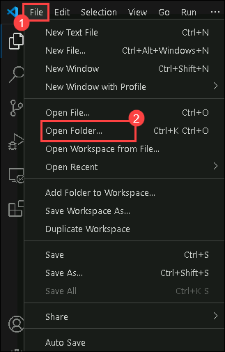
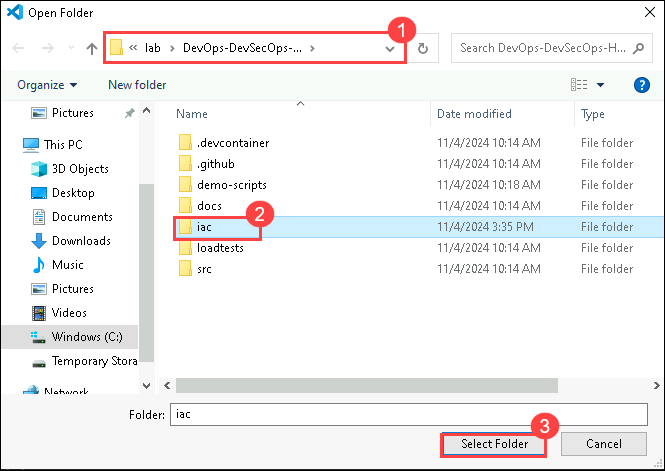

# Challenge 04: Implementing Monitoring Solutions for Contoso Traders

## Introduction

In this challenge, the user/attendee will integrate Azure's monitoring tools—Azure Monitor and Application Insights—into their Azure-based application. Monitoring is vital for maintaining efficiency and resilience in cloud applications, enabling proactive issue identification and seamless user experiences.

This is the solution guide that contains all of the comprehensive, step-by-step directions needed to finish the challenge.

## Solution Guide

### Task 1: Deploy Monitoring Infrastructure

1. You will deploy the complete monitoring infrastructure using the Bicep template named `monitoringinfra.bicep`. The monitoring infrastructure includes Application Insights, a secret created for Application Insights, and a monitoring dashboard.

1. Open VS Code within the Vm, and then click on **File (1)** at the top left corner and then select **Open Folder (2)**.

    

1. Navigate to **C:\Workspaces\lab\DevOps-DevSecOps-Hackathon-lab-files\iac (1)** path ,  select **iac (2)** and click on **Open folder (3)**.

    

1. Open the **monitoringinfra.parameters.json (1)** file. Locate the env parameter in the JSON file and update its value with the **deployment ID (2).** and then save.

   >**Note**: You can also find the deployment ID within the environment details tab of your integrated lab guide.

1. In the VS Code Terminal, run the following command to log in to your Azure account:

   ```
   Connect-AzAccount
   ```
   >**Note**: Please use the below-mentioned credentials to login to Azure.
      - **Email/Username:** <inject key="AzureAdUserEmail"></inject>
      - **Password:** <inject key="AzureAdUserPassword"></inject>
      
1. Set the Resource Group Name before running the deployment command. set the  **$RGname** as **contoso-traders-rg<inject key="Deploymentid" enableCopy="false" />**

   ```
   $RGname = <update the existing RG name>
   ```
   
   >**Note:** Make sure you are in the directory where the Bicep template and parameters file resides. 
              cd C:\Workspaces\lab\DevOps-DevSecOps-Hackathon-lab-files\iac
   
1. Run the following command to initiate the deployment using the Bicep template and parameters file:

   ```
   New-AzResourceGroupDeployment -Name "createresource" -TemplateFile "monitoringinfra.bicep" -TemplateParameterFile "monitoringinfra.parameters.json" -ResourceGroup $RGname
   ```
1. Monitor the output in the terminal , and wait for until the deployment is succeeded.

   
   
### Task 2: Monitoring using Application Insights

1. In the Azure Portal, navigate to the **contoso-traders-rg<inject key="Deploymentid" enableCopy="false" />** **(1)** resource group and select the **Application Insights** resource with the name  **contoso-traders-ai<inject key="Deploymentid" enableCopy="false" />** **(2)**.

   
   
1. From the Overview of **contoso-traders-ai<inject key="Deploymentid" enableCopy="false" />** Application Insights resource, you can set the **Show data for last** as per your requirement of monitoring insights.

   
   
1. In the first graph, you can see the number of failed requests for Application access.

   
   
1. In the next graph, you can see the average server response time.

   
   
1. In the next graph, you can see the number of server requests.

   
   
1. In the last graph, you can see the average availability.

     

## Success criteria:
To complete this challenge successfully:

- Successful integration of Azure Monitor and Application Insights within the application environment, ensuring seamless data collection and monitoring capabilities.
- Selection and configuration of key performance metrics relevant to the application's functionality and performance goals.
- Establishment of effective alerting mechanisms with well-defined thresholds, ensuring timely notifications for potential issues or deviations in monitored metrics.

## Additional Resources:

- Refer to [Application Insights Overview](https://learn.microsoft.com/en-us/azure/azure-monitor/app/app-insights-overview) for reference.
- [Application Insights for ASP.NET Core applications](https://learn.microsoft.com/en-us/azure/azure-monitor/app/asp-net-core?tabs=netcorenew%2Cnetcore6).
- Refer to [Azure Monitor vs. Application Insights](https://azurelib.com/azure-monitor-vs-application-insights/) for reference.
