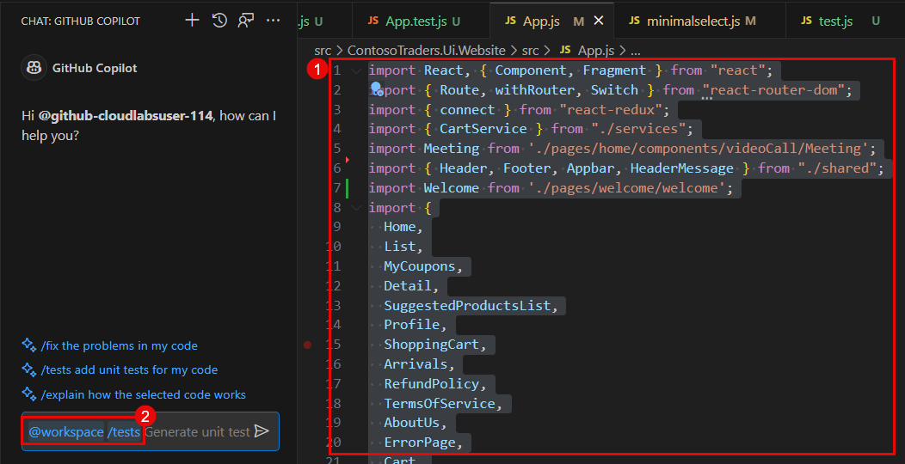
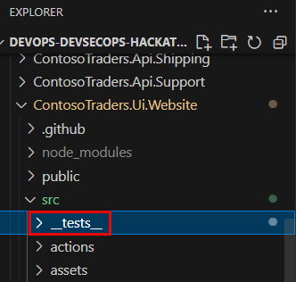
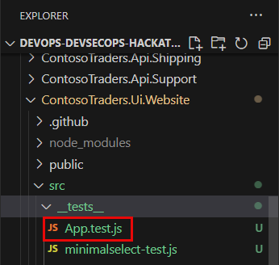
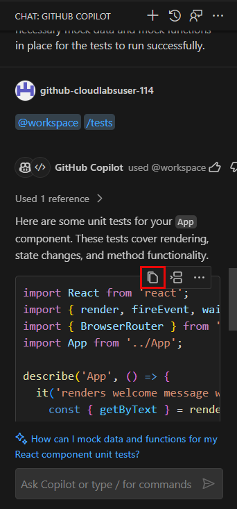
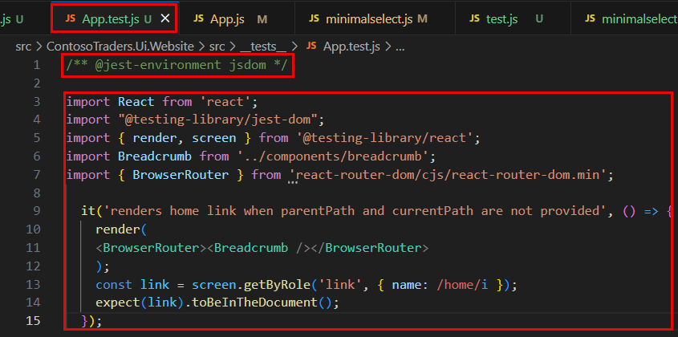
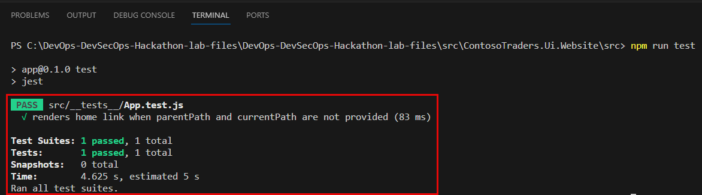
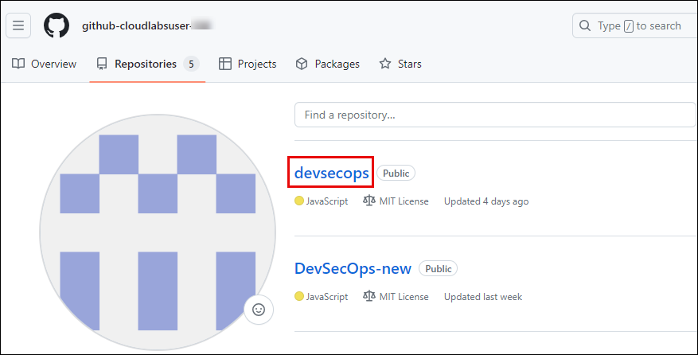
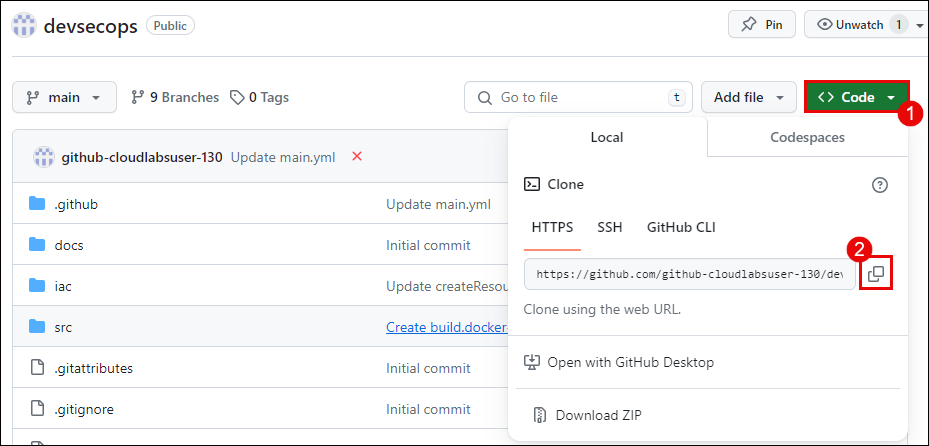
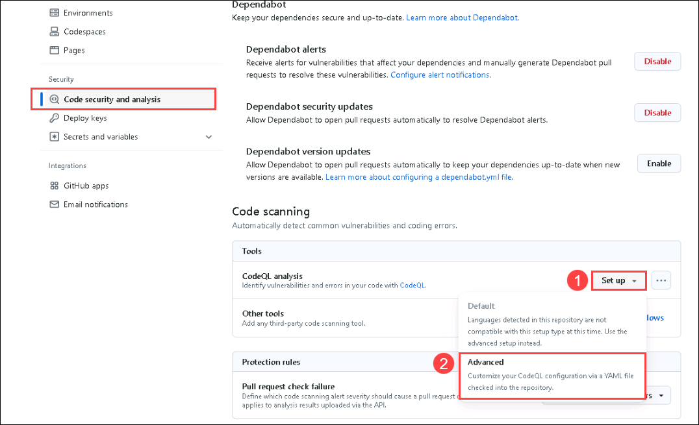

# Challenge 07: Enhancing Contoso Traders with GitHub Copilot

## Introduction

Contoso Traders is a web application for stock trading. In this challenge, as a DevOps engineer, your focus is to seamlessly implement and test new features with Copilot, ensuring accuracy and alignment. Conduct a thorough code review and enhance security using GitHub Advanced Security's CodeQL. Streamline development with a GitHub Actions CI/CD pipeline for Contoso Traders, ensuring efficient and secure deployment.

This is the solution guide that contains all of the comprehensive, step-by-step directions needed to finish the challenge.

## Solution Guide

## Exercise 1: Feature Addition with GitHub Copilot

### Task 1: Sign in to GitHub Copilot in Visual Studio Code

1. Open **Visual Studio Code** from the desktop screen. 

   
   
1. At the bottom right corner, click on **Sign in to GitHub** prompt that appears.

   

1. Next, once you get the popup, click on **Allow**.

   

1. In the sign-in to GitHub page in edge browser, enter the **GitHub UserEmail** and **GitHub Password** and click on **Sign in**.

   

   >**Note:** To view the GitHub credentials, access the lab named **GitHub Copilot Lab: GitHub Credentials**, which is present within the third learning path of this course.

   

   >**Note:** Once the lab has been deployed successfully, navigate to the **Environment** tab to view the key-value pairs of the **GitHub UserEmail**, and **GitHub Password**. You can use the copy buttons under the actions column to have the values copied instantly. Alternatively, it is suggested to have the values copied over onto a notepad for easy accessibility. 

   

1. Next, to get the authentication code, sign in to Outlook in the Lab VM through an **InPrivate** window (https://outlook.office365.com/mail/)
with the github credentials that were copied over to Notepad in the previous step. After logging into Outlook within the Lab Virtual Machine, locate the most recent email that contains the verification code, and then select **Verify** to return to the login screen.

   >**Note:** The email containing the verification code can sometimes creep into the archive/spam folders within your Outlook.

   

1. Next, click on **Authorize Visual-Studio-Code** to provide additional permissions to GitHub for VS Code on the following page if asked for, as shown in the screenshot below:

   

1. You will encounter a pop-up prompt. Click **Open** to proceed.

   
   
   >**Note:** If you get another pop-up stating **Allow an extension to open this URI**, please click on **Open**.

1. You will be able to see in the bottom right corner that Github Copilot has been activated.

   

   >**Note:** If the activation status of Github Copilot in the bottom right corner is not visible, try restarting Visual Studio Code to ensure that the activation status becomes visible in that location.

1. Verify if **GitHub Copilot Chat** is installed. If its installed, the below icon should appear in the left navigation pane.
   
    
   

### Task 2: Create a new file in Visual Studio Code

>**NOTE:** It should be noted that the code suggestions offered by GitHub Copilot might not exactly match the screenshots shown within the labguide. GitHub Copilot is an AI-powered tool that generates code based on context and patterns, and its suggestions can be influenced by various factors. It is also important that you have the knowledge on operating and running React Applications which may be needed as you proceed with this exercise.

1. In Visual Studio Code, go to **Explorer (1)** and click on **Open Folder (2)**. Navigate to **C:\Workspaces\lab\DevOps-DevSecOps-Hackathon-lab-files** within the file explorer, and select the **DevOps-DevSecOps-Hackathon-lab-files** folder.

     

2. Ensure to click on **Yes, I trust the authors** within the pop-up to successfully import the CloudLabs folder into VS Code.

   

3. Once the project has loaded, within the explorer pane, navigate to `C:\Workspaces\lab\DevOps-DevSecOps-Hackathon-lab-files\src\ContosoTraders.Ui.Website\src` to view the `App.js` file.

   

4. Within the **CHAT: GITHUB COPILOT** pane, type: `Help me add a welcome page into the current project` and observe the AI response. You can follow the instructions provided by GitHub Copilot towards successfully adding the welcome page as a part of the Contoso Traders Application.

   

5. Create a new file named `Welcome.js` **(1)** in your `pages` directory ie., within the path `C:\Workspaces\lab\DevOps-DevSecOps-Hackathon-lab-files\src\ContosoTraders.Ui.Website\src\pages\welcome` and then add the following code:

   ```
   import React from 'react';

   const Welcome = () => {
     return (
       <div>
         <h1>Welcome to our site!</h1>
         <p>This is the welcome page.</p>
       </div>
     );
   };
   
   export default Welcome;
   ```

   >**Note:** This `Welcome.js` file, defines a new component that will serve as your welcome page. This is where you'll write the code for the same.

   

6. Save the newly created `Welcome.js` file.

7. Now we need to import this new component into your `App.js` file. `App.js` is usually the main file in a React application. You'll need to import the Welcome component into the `App.js` file by using the following code:

   ```
   import Welcome from './pages/welcome/welcome'; // assuming a new directory named `welcome` within `pages`.
   ```

   

8. Next, you must add a new `Route` for the `Welcome` page by using the following code within the `App.js` file:

   ```
   return (
     <div>
       {this.renderWelcomeMessage()}
       {/* Rest of your app goes here */}
       <div className="App">
         <Fragment>
           <div className="mainHeader">
             <HeaderMessage type="warning" icon={warningIcon} message="This Is A Demo Store For Testing Purposes — No Orders Shall Be Fulfilled."/>
             <Appbar quantity={quantity} />
             {this.props.history.location.pathname === '/' || this.props.history.location.pathname === '/new-arrivals' ?
               <Header quantity={quantity} />
               :
               <div id="box"></div>}
           </div>
           <Route path="/welcome" component={Welcome} /> {/* Add this line */}
         </Fragment>
       </div>
     </div>
   );
   ```

   

   >**Note:** The above code tells the router to show the `Welcome` component when the URL path is `/welcome`. Now, if you navigate to `http://localhost:3000/welcome` in your web browser (assuming your React app is running on localhost port 3000), you should see your welcome page!
   
   >**Note:** Please note that the placement of the Route component might need to be adjusted based on the exact structure and requirements of your application.

9. To run your React application, you typically use the command line (also known as the terminal). Here are the steps:
      - Within Visual Studio Code, you can open the terminal by going to the top menu and selecting View -> Terminal **(1)**.
      - Navigate to your project directory. You can do this with the `cd` command followed by the path to your project. You can use the below command to navigate to the React application's working directory **(2)**:
      ```
      cd C:\Workspaces\lab\DevOps-DevSecOps-Hackathon-lab-files\src\ContosoTraders.Ui.Website\src
      ``` 
      - Once you're in your project directory, you can start the application with the `npm start` **(3)** because we need npm to create the Contoso Traders Application. After running the following command within the terminal, your application should start, and you can view it in your web browser at http://localhost:3000.
      ```
      npm run start
      ```
      
   

## Exercise 2: Generate and run Unit Test cases using GitHub Coplilot:

### Task 1: Create and run test cases:

1. In Visual Studio Code, go to **Explorer (1)** and navigate to `C:\Workspaces\lab\DevOps-DevSecOps-Hackathon-lab-files\src\ContosoTraders.Ui.Website\src` and open the `App.js` file.

   

2. Select all code lines `[CTRL+A]` within the `App.js` file **(1)** and then paste the following prompt **(2)** within the GitHub Copilot Chat Panel:
   ```
   /tests
   ```

   

3. Now create a new folder named `_tests_` under the path `C:\Workspaces\lab\DevOps-DevSecOps-Hackathon-lab-files\src\ContosoTraders.Ui.Website\src`.

   

4. Create a new test file named `App.test.js` within the `_tests_` folder.

   

5. Navigate back to the GitHub Copilot chat panel and copy the unit test that has been generated using Copilot for your `App` component. Ensure to paste these unit test cases within the newly created file - `App.test.js` under the `_tests_` folder and save the file.

   

   

   >**Note:** Ensure to add the following code line at the beginning of your `App.test.js` file as shown in the above screenshot. The comment `/** @jest-environment jsdom */` is a directive used in Jest to specify the testing environment for a particular test file. In this case, it indicates that the test should be executed in a JavaScript Document Object Model (DOM) environment, specifically provided by jsdom.

6. Once ready with the test cases, open a new terminal within Visual Studio Code, and navigate to the following path/directory by running the below command within the terminal:

   ```
   cd C:\DevOps-DevSecOps-Hackathon-lab-files\DevOps-DevSecOps-Hackathon-lab-files\src\ContosoTraders.Ui.Website\src>
   ```

   >**Note:** Ensure that your current working directory within the terminal has the `_tests_` folder in its present path. In this scenario, the `_tests_` folder is present inside the `/src` directory. 

7. To execute the unit test cases genereated by GitHub Copilot, we need to run the `App.test.js` file using the following command within the terminal:

   ```
   npm run test
   ```

8. Post execution of the above unit test, you must ensure to have a successful - `PASS` test runs with no errors. If you are produced with errors, please understand the intricacies of the error as mentioned within the terminal and work towards a successful unit test run.

   

## Exercise 3: Code Review and Security Check

### Task 1: Submit Codebase Modifications to GitHub Repository

1.  In a new browser tab, open ```https://www.github.com/login```. From the **Environment Details** page **(1)**, navigate to **License** **(2)** tab and **copy** **(3)** the credentials. Use the same username and password to log into GitHub.

    

2. once logged-in, on the upper-right corner, expand the user **drop-down menu** **(1)** and select **Your repositories** **(2)**.

   

3. Select the repository that you created earlier named, `devsecops`.

   

4. On the repository's home page, click on **<>Code (1)** and then copy the `HTTPS` web URL link **(2)** of your GitHub repository onto a notepad. This URL will be used as you progress ahead in the following steps.

   

5. From the GitHub username, note down the **Unique-ID** present in the Username. You'll need this in the upcoming steps.

   

6. Navigate back to the **Visual Studio Code** application in which the terminal is already open. In the terminal, click on the **drop-down** button and select **PowerShell** to open a fresh PowerShell terminal tab.

   

7. In Visual Studio Code, run the below commands in the terminal to set your **email** and **username**, which Git uses for commits. Make sure to replace the GitHub account email and username.
   
     ```pwsh
     cd C:\Workspaces\lab\DevOps-DevSecOps-Hackathon-lab-files
     git config --global user.email "you@example.com"
     git config --global user.name "Your UserName"
     ```
     
    
     
    Run the below-mentioned command in the terminal. Make sure to replace `your_github_repository-url` with the value you copied in step 4 and `Unique-ID` in step 5.

    Note: This step is done to initialize the folder as a Git repository, commit, and submit contents to the remote GitHub branch “main” in the lab files repository created named `devsecops`. 

      ```pwsh
      git init
      git add .
      git commit -m "Initial commit"
      git branch -M main
      git remote add origin<Unique-ID> <your_github_repository-url>
      git push -u origin<Unique-ID> main
      ```
     
   - If you are asked to authenticate your GitHub account, select **Sign in with your browser**, and you will be prompted with a pop-up window to authorize Git Credential Manager. Click on **Authorize git-ecosystem** to provide access.

       
       
   - After you are prompted with the message **Authorization Succeeded**, close the tab and continue with the next task.

### Task 2: Implement Code Scanning and CodeQL

In this task, you'll configure Code scanning and explore CodeQL alerts. Code scanning is a feature that you use to analyze the code in a GitHub repository to find security vulnerabilities and coding errors. Any problems identified by the analysis are shown on GitHub.

**Note**: To perform this task, the GitHub repository should be public. If the repository visibility is private, please go to the settings of the repository and change the visibility to public.

1. Login to GitHub where the `devsecops` repository was created.

2. Considering that you have already created the `CodeQL` GitHub Action in challenge 2; select the **Actions** ***(1)*** tab from the GitHub browser tab. Click on **CodeQL** ***(2)*** workflow under the **All workflows** section of the left navigation pane.

   

3. Verify Successful Execution of the **CodeQL** GitHub Action for using the `codeql-analysis.yml` Workflow File. The trigger for this action being the recent push from Visual Studio Code. 

   

5. If you have not implemented Code Scanning and CodeQL within your repository, follow steps 6 - 11 of this task to perform code review and security checks.

6. Select the **settings** ***(1)*** tab from the GitHub browser tab. Click on **code security and analysis** ***(2)*** under the security side blade.

   

7. Click on the **Set up** **(1)** button to enable CodeQL analysis, and select the **Advanced** **(2)** option for creating a CodeQL Analysis YAML file.

   

8. Update the workflow name to **codeql-analysis.yml** ***(1)*** and review the yaml file. Select **Commit changes** ***(2)***, then select **Commit directly to the main branch** ***(3)***, and click on **Commit new file** ***(4)***.
  
   

   

9. Navigate to the **Actions** ***(1)*** tab, here you can review the **workflow** ***(2)*** run.
    
   

10. Navigate to the **Security** ***(1)*** tab and click on **View alerts** ***(2)***.
   
   

11. You will be navigated to the **Code scanning** section. You'll be able to visualize the **No code scanning alerts here!**.
   
   

### Task 3: Implement Repository security advisories

In this task, you'll enable Repository security advisories. You can use GitHub Security Advisories to privately discuss, fix, and publish information about security vulnerabilities in your repository. Anyone with admin permissions to a repository can create a security advisory.

1. Navigate to the **Security** ***(1)*** tab, select **Advisories** ***(2)*** from the side blade, and click on **New draft security advisory** ***(3)***.

   

2. In the Open a draft security advisory tab, under the Advisory Details section, provide the following details:

   - Title: **Improper Access Control in devsecops/src/TailwindTraders.Ui.Website/src/App.js** ***(1)***
   - CVE identifier: **Request CVE ID later** ***(2)***
   - Description: **Add** ***(3)*** the below-mentioned details in the description section.
   
   ```
   Impact
   What kind of vulnerability is it? Who is impacted?

   HTTP request handlers should not perform expensive operations such as accessing the file system, executing an operating system command, or interacting with a database without limiting the rate at which requests are accepted. Otherwise, the application becomes vulnerable to denial-of-service attacks where an attacker can cause the application to crash or become unresponsive by issuing a large number of requests at the same time.

   Patches
   Has the problem been patched? What versions should users upgrade to?

   It is patched and rectified the error. Please use 1.2 version

   Workarounds
   Is there a way for users to fix or re../mediate the vulnerability without upgrading?

   // set up rate limiter: maximum of five requests per minute
   var RateLimit = require('express-rate-limit');
   var limiter = new RateLimit({
   windowMs: 1601000, // 1 minute
   max: 5
   });

   // apply rate limiter to all requests
   app.use(limiter);

   Added the above code in app.js

   References
   Are there any links users can visit to find out more?

   https://github.com/OWASP/API-Security/blob/master/2019/en/src/0xa4-lack-of-resources-and-rate-limiting.md
   https://codeql.github.com/codeql-query-help/javascript/js-missing-rate-limiting/
   ```
    
   

3. In the **Affected products** section, provide the following details and click on **Create draft security advisory** ***(7)***   
 
   - Ecosystem: **composer** ***(1)***
   - Package name: **devsecops/src/TailwindTraders.Ui.Website/src/App.js** ***(2)***
   - Affected version: **<1.2** ***(3)***
   - Patched version: **1.2** ***(4)***
   - Severity: **High** ***(5)***
   - Common Weakness Enumerator (CWE): **Improper Access Control (CWE-284)** ***(6)***
  
   

4. Once the security advisory is created, scroll down and click on **start a temporary private fork**. It is used to collaborate on a patch for this advisory.

    
    
    

5. After having the temporary fork, you can request a CVE. It is used for GitHub reviews and published security advisories. Upon review, we may use this advisory to send Dependabot alerts to affected repositories and redistribute the advisory through our API and Atom feed.

## Exercise 4: CI/CD Pipeline Setup and infrastrucure Deployment

>**Note:** This exercise is dependent on the completion of Challenge 1 which requires:
   - Updated parameters within `iac/createResources.parameters.json` file.
   - Creation of new Action Secrets named **SERVICEPRINCIPAL**, **SQL_PASSWORD** and **ENVIRONMENT**.
   - Updated resource group name in `iac/createResourceGroup.bicep` file.
   - Updated `RESOURCE_GROUP_NAME` environment variable within `.github/workflow/deploy-infrastructure.yml` file.
   - If you haven't satisfied the above dependencies, start this exercise by following instructions from step 4 (Ignore steps 1, 2 and 3).
 
1. To run the infrastucture deployment workflow created in challenge 1, perform the following steps and wait for the resources to be deployed within your Azure Portal:
      - Click on **Actions (1)** within your GitHub repository.
      - Select the workflow named **contoso-traders-provisioning-deployment (2)**.
      - Click on **Run workflow (3)**.
      - Finally, click on **Run workflow (4)**. Ensure that the branch is selected as **main**.

      

2. Navigate to `.github/workflow/update-contoso-traders-App.yml` path, ensure to update the `AKS_NODES_RESOURCE_GROUP_NAME` and`RESOURCE_GROUP_NAME` environment variable by replacing `<deployment-id>` with **<inject key="DeploymentID" enableCopy="false" />**.

    

3. To update the application, run the workflow by performing the following steps and wait for the resources to be deployed within your azure portal:
      - Click on **Actions (1)** within your GitHub repository.
      - Select on the workflow named **update contoso traders app (2)**.
      - Click on **Run workflow (3)**.
      - Finally click on **Run workflow (4)**. Ensure that the branch is select as **main**.

     

4. Within the GitHub repository, navigate to the `iac/createResources.parameters.json` path and update the value of the following parameters:
   - Replace `deploymentidvalue` with **<inject key="DeploymentID" enableCopy="false" /> (1)**.
   - Replace `bicepsqlpass` value with **<inject key="AzureAdUserPassword"></inject> (2)**.
  
       

5. To create GitHub secrets, in your GitHub lab files repository, click on the **Settings** tab.

      

6. Navigate to **Environment Details** **(1)**, click on **Service Principal Details** **(2)**, and copy the **Subscription ID**, **Tenant ID (Directory ID)**, **Application ID (Client ID)**, and **Secret Key (Client Secret)**.

      
   
      - Replace the values that you copied in the below JSON. You will be using them in this step.
      
      ```json
      {
         "clientId": "zzzzzzzz-zzzz-zzzz-zzzz-zzzzzzzzzzzz",
         "clientSecret": "zzzzzzzzzzzzzzzzzzzzzzzzzzzzzzzzzzzzzzzz",
         "tenantId": "zzzzzzzz-zzzz-zzzz-zzzz-zzzzzzzzzzzz",
         "subscriptionId": "zzzzzzzz-zzzz-zzzz-zzzz-zzzzzzzzzzzz"
      }
      ```

7. Under **Security**, expand **Secrets and variables** **(1)** by clicking the drop-down and select **Actions** **(2)** blade from the left navigation bar. Select the **New repository secret** **(3)** button.

   

8. Under the **Actions Secrets/New secret** page, enter the below-mentioned details and click on **Add secret** **(3)**.

   - **Name** : Enter **SERVICEPRINCIPAL** **(1)**
   - **Value** : Paste the service principal details in JSON format **(2)**
   
   

9. To create another secret, under the **Actions Secrets/New secret** page, enter the below-mentioned details and click on **Add secret** ***(3)***.

   - **Name**: Enter **SQL_PASSWORD** ***(1)***
   - **Value**: Enter **<inject key="AzureAdUserPassword"></inject> (2)**, which would be the same as the Azure AD Password.

   

10. Under the **Actions Secrets/New secret** page, enter the below-mentioned details and click on **Add secret** ***(3)***.

   - **Name** : Enter **ENVIRONMENT** ***(1)***
   - **Value** : **<inject key="DeploymentID" enableCopy="false" />** (Copy the Deployment ID from the environment details tab) ***(2)***
   
   

11. Now within the GitHub repository, navigate to the `iac/createResourceGroup.bicep` path and update the resource group name as mentioned below:
   - Replace `<deployment-id>` with **<inject key="DeploymentID" enableCopy="false" />**.

   

12. Navigate to the `.github/workflow/deploy-infrastructure.yml` path and ensure to update the `RESOURCE_GROUP_NAME` environment variable by replacing `<deployment-id>` with **<inject key="DeploymentID" enableCopy="false" />**.

   

13. To run a workflow, perform the following steps and wait for the resources to be deployed within your Azure Portal:
      - Click on **Actions (1)** within your GitHub repository.
      - Select the workflow named **contoso-traders-provisioning-deployment (2)**.
      - Click on **Run workflow (3)**.
      - Finally, click on **Run workflow (4)**. Ensure that the branch is selected as **main**.

      

14. Navigate to `.github/workflow/update-contoso-traders-App.yml` path, ensure to update the `AKS_NODES_RESOURCE_GROUP_NAME` and`RESOURCE_GROUP_NAME` environment variable by replacing `<deployment-id>` with **<inject key="DeploymentID" enableCopy="false" />**.

    

15. To run a workflow, perform the following steps and wait for the resources to be deployed within your azure portal:
      - Click on **Actions (1)** within your GitHub repository.
      - Select on the workflow named **update contoso traders app (2)**.
      - Click on **Run workflow (3)**.
      - Finally click on **Run workflow (4)**. Ensure that the branch is select as **main**.

     


## Success criteria:
To complete this challenge successfully:

- Successful integration of Azure Monitor and Application Insights within the application environment, ensuring seamless data collection and monitoring capabilities.
- Selection and configuration of key performance metrics relevant to the application's functionality and performance goals.
- Establishment of effective alerting mechanisms with well-defined thresholds, ensuring timely notifications for potential issues or deviations in monitored metrics.

## Additional Resources:

- Refer to [Continuous validation with Azure Load Testing and Azure Chaos Studio](https://learn.microsoft.com/en-us/azure/architecture/guide/testing/mission-critical-deployment-testing) for reference.
- [What is Azure Chaos Studio?](https://learn.microsoft.com/en-us/azure/chaos-studio/chaos-studio-overview).
- [Load test a website by using a JMeter script in Azure Load Testing](https://learn.microsoft.com/en-us/azure/load-testing/how-to-create-and-run-load-test-with-jmeter-script?tabs=portal).
- [Intro to Chaos Engineering and Azure Chaos Studio](https://pdtit.medium.com/intro-to-chaos-engineering-and-azure-chaos-studio-preview-5e85fff10642).
