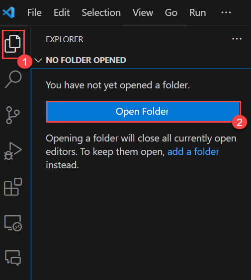
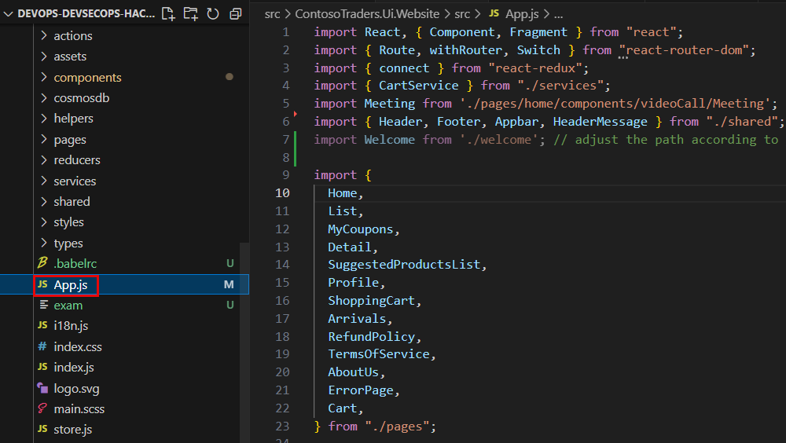
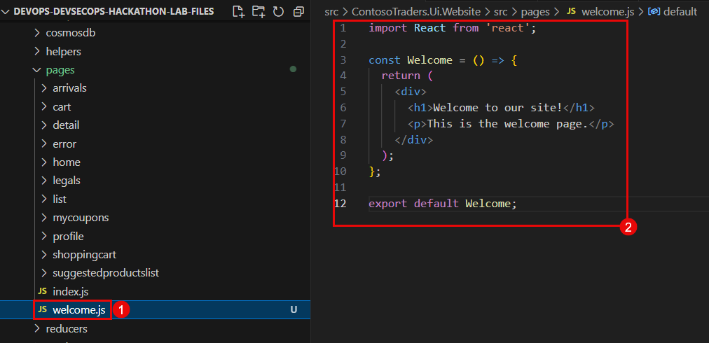
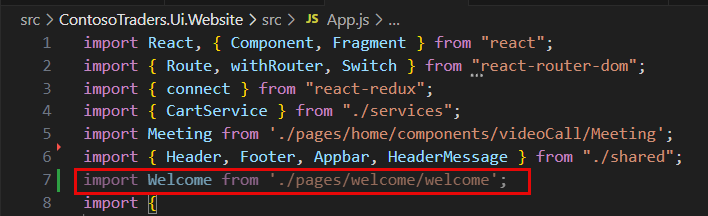
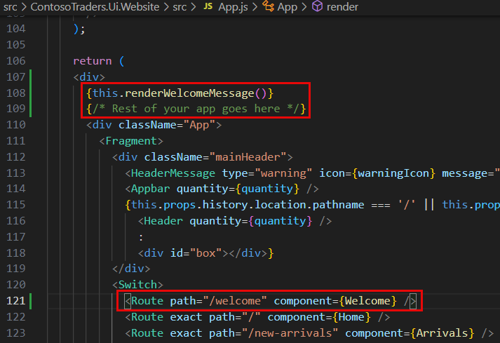
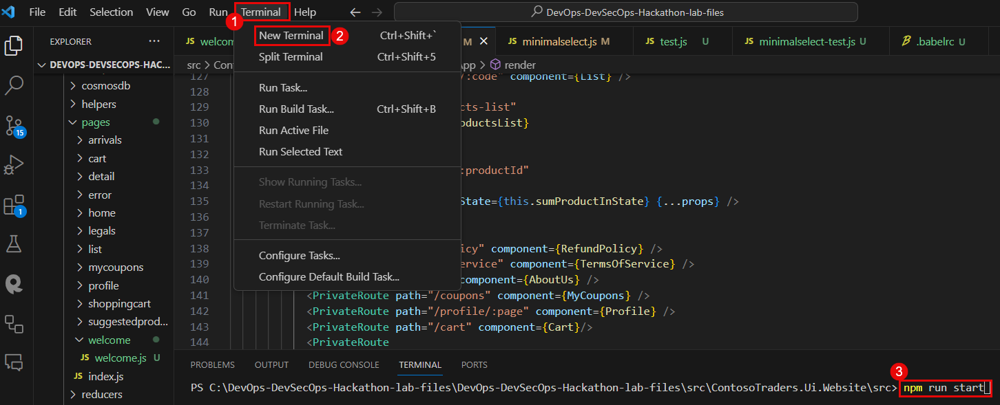
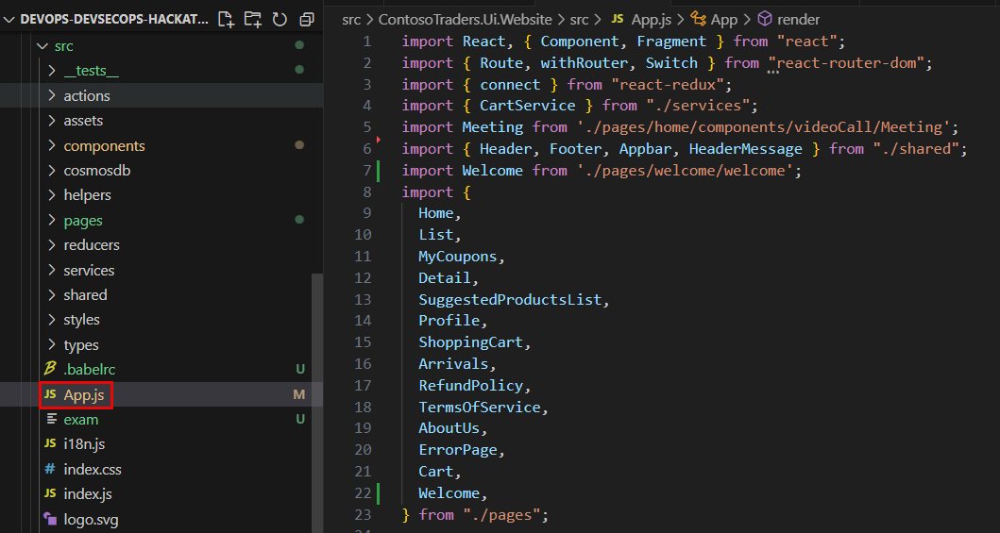

# Challenge 07: Enhancing Contoso Traders with GitHub Copilot

## Introduction

Contoso Traders is a web application for stock trading. In this challenge, as a DevOps engineer, your focus is to seamlessly implement and test new features with Copilot, ensuring accuracy and alignment. Conduct a thorough code review and enhance security using GitHub Advanced Security's CodeQL. Streamline development with a GitHub Actions CI/CD pipeline for Contoso Traders, ensuring efficient and secure deployment.

This is the solution guide that contains all of the comprehensive, step-by-step directions needed to finish the challenge.

## Solution Guide

## Exercise 1: Feature Addition with GitHub Copilot

### Task 1: Sign in to GitHub Copilot in Visual Studio Code

1. Open **Visual Studio Code** from the desktop screen. 

   
   
1. At the bottom right corner, click on **Sign in to GitHub** prompt that appears.

   

1. Next, once you get the popup, click on **Allow**.

   

1. In the sign-in to GitHub page in edge browser, enter the **GitHub UserEmail** and **GitHub Password** and click on **Sign in**.

   

   >**Note:** To view the GitHub credentials, access the lab named **GitHub Copilot Lab: GitHub Credentials**, which is present within the third learning path of this course.

   

   >**Note:** Once the lab has been deployed successfully, navigate to the **Environment** tab to view the key-value pairs of the **GitHub UserEmail**, and **GitHub Password**. You can use the copy buttons under the actions column to have the values copied instantly. Alternatively, it is suggested to have the values copied over onto a notepad for easy accessibility. 

   

1. Next, to get the authentication code, sign in to Outlook in the Lab VM through an **InPrivate** window (https://outlook.office365.com/mail/)
with the github credentials that were copied over to Notepad in the previous step. After logging into Outlook within the Lab Virtual Machine, locate the most recent email that contains the verification code, and then select **Verify** to return to the login screen.

   >**Note:** The email containing the verification code can sometimes creep into the archive/spam folders within your Outlook.

   

1. Next, click on **Authorize Visual-Studio-Code** to provide additional permissions to GitHub for VS Code on the following page if asked for, as shown in the screenshot below:

   

1. You will encounter a pop-up prompt. Click **Open** to proceed.

   
   
   >**Note:** If you get another pop-up stating **Allow an extension to open this URI**, please click on **Open**.

1. You will be able to see in the bottom right corner that Github Copilot has been activated.

   

   >**Note:** If the activation status of Github Copilot in the bottom right corner is not visible, try restarting Visual Studio Code to ensure that the activation status becomes visible in that location.

1. Verify if **GitHub Copilot Chat** is installed. If its installed, the below icon should appear in the left navigation pane.
   
    
   

### Task 2: Create a new file in Visual Studio Code

>**NOTE:** It should be noted that the code suggestions offered by GitHub Copilot might not exactly match the screenshots shown within the labguide. GitHub Copilot is an AI-powered tool that generates code based on context and patterns, and its suggestions can be influenced by various factors. It is also important that you have the knowledge on operating and running React Applications which may be needed as you proceed with this exercise.

1. In Visual Studio Code, go to **Explorer (1)** and click on **Open Folder (2)**. Navigate to **C:\Workspaces\lab\DevOps-DevSecOps-Hackathon-lab-files** within the file explorer, and select the **DevOps-DevSecOps-Hackathon-lab-files** folder.

     

2. Ensure to click on **Yes, I trust the authors** within the pop-up to successfully import the CloudLabs folder into VS Code.

   

3. Once the project has loaded, within the explorer pane, navigate to `C:\Workspaces\lab\DevOps-DevSecOps-Hackathon-lab-files\src\ContosoTraders.Ui.Website\src` to view the `App.js` file.

   

4. Within the **CHAT: GITHUB COPILOT** pane, type: `Help me add a welcome page into the current project` and observe the AI response. You can follow the instructions provided by GitHub Copilot towards successfully adding the welcome page as a part of the Contoso Traders Application.

   

5. Create a new file named `Welcome.js` **(1)** in your `pages` directory ie., within the path `C:\Workspaces\lab\DevOps-DevSecOps-Hackathon-lab-files\src\ContosoTraders.Ui.Website\src\pages\welcome` and then add the following code:

   ```
   import React from 'react';

   const Welcome = () => {
     return (
       <div>
         <h1>Welcome to our site!</h1>
         <p>This is the welcome page.</p>
       </div>
     );
   };
   
   export default Welcome;
   ```

   >**Note:** This `Welcome.js` file, defines a new component that will serve as your welcome page. This is where you'll write the code for the same.

   

6. Save the newly created `Welcome.js` file.

7. Now we need to import this new component into your `App.js` file. `App.js` is usually the main file in a React application. You'll need to import the Welcome component into the `App.js` file by using the following code:

   ```
   import Welcome from './pages/welcome/welcome'; // assuming a new directory named `welcome` within `pages`.
   ```

   

8. Next, you must add a new `Route` for the `Welcome` page by using the following code within the `App.js` file:

   ```
   return (
     <div>
       {this.renderWelcomeMessage()}
       {/* Rest of your app goes here */}
       <div className="App">
         <Fragment>
           <div className="mainHeader">
             <HeaderMessage type="warning" icon={warningIcon} message="This Is A Demo Store For Testing Purposes — No Orders Shall Be Fulfilled."/>
             <Appbar quantity={quantity} />
             {this.props.history.location.pathname === '/' || this.props.history.location.pathname === '/new-arrivals' ?
               <Header quantity={quantity} />
               :
               <div id="box"></div>}
           </div>
           <Route path="/welcome" component={Welcome} /> {/* Add this line */}
         </Fragment>
       </div>
     </div>
   );
   ```

   

   >**Note:** The above code tells the router to show the `Welcome` component when the URL path is `/welcome`. Now, if you navigate to `http://localhost:3000/welcome` in your web browser (assuming your React app is running on localhost port 3000), you should see your welcome page!
   
   >**Note:** Please note that the placement of the Route component might need to be adjusted based on the exact structure and requirements of your application.

9. To run your React application, you typically use the command line (also known as the terminal). Here are the steps:
      - Within Visual Studio Code, you can open the terminal by going to the top menu and selecting View -> Terminal **(1)**.
      - Navigate to your project directory. You can do this with the `cd` command followed by the path to your project. You can use the below command to navigate to the React application's working directory **(2)**:
      ```
      cd C:\Workspaces\lab\DevOps-DevSecOps-Hackathon-lab-files\src\ContosoTraders.Ui.Website\src
      ``` 
      - Once you're in your project directory, you can start the application with the `npm start` **(3)** because we need npm to create the Contoso Traders Application. After running the following command, your application should start, and you can view it in your web browser at http://localhost:3000.
      ```
      npm run start
      ```
      
   

## Exercise 2: Generate and run Unit Test cases using GitHub Coplilot:

### Task 1: Generate Unit Tests using GitHub Copilot Chat:

1. In Visual Studio Code, go to **Explorer (1)** and navigate to `C:\Workspaces\lab\DevOps-DevSecOps-Hackathon-lab-files\src\ContosoTraders.Ui.Website\src` and open the `App.js` file.

   

2. Select all code lines `[CTRL+A]` within the `App.js` file **(1)** and then paste the following prompt within the GitHub Copilot Chat Panel:
   ```
   
   ```

4. Now navigate to the GitHub Copilot Chat panel, 

## Success criteria:
To complete this challenge successfully:

- Successful integration of Azure Monitor and Application Insights within the application environment, ensuring seamless data collection and monitoring capabilities.
- Selection and configuration of key performance metrics relevant to the application's functionality and performance goals.
- Establishment of effective alerting mechanisms with well-defined thresholds, ensuring timely notifications for potential issues or deviations in monitored metrics.

## Additional Resources:

- Refer to [Continuous validation with Azure Load Testing and Azure Chaos Studio](https://learn.microsoft.com/en-us/azure/architecture/guide/testing/mission-critical-deployment-testing) for reference.
- [What is Azure Chaos Studio?](https://learn.microsoft.com/en-us/azure/chaos-studio/chaos-studio-overview).
- [Load test a website by using a JMeter script in Azure Load Testing](https://learn.microsoft.com/en-us/azure/load-testing/how-to-create-and-run-load-test-with-jmeter-script?tabs=portal).
- [Intro to Chaos Engineering and Azure Chaos Studio](https://pdtit.medium.com/intro-to-chaos-engineering-and-azure-chaos-studio-preview-5e85fff10642).
