# Challenge 07: Enhancing Contoso Traders with GitHub Copilot

## Introduction

Contoso Traders is an e-commerce web application. In this challenge, as a DevOps engineer, your focus is to seamlessly implement and test new features with Copilot, ensuring accuracy and alignment. Conduct a thorough code review and enhance security using GitHub Advanced Security's CodeQL. Streamline development with a GitHub Actions CI/CD pipeline for Contoso Traders, ensuring efficient and secure deployment.

This is the solution guide that contains all of the comprehensive, step-by-step directions needed to finish the challenge.

## Solution Guide

## Exercise 1: Integrate an 'About Us' app component in React using GitHub Copilot

### Task 1: Sign in to GitHub Copilot in Visual Studio Code

1. Open **Visual Studio Code** from the desktop screen. 

   
   
1. At the bottom right corner, click on **Sign in to GitHub** prompt that appears.

   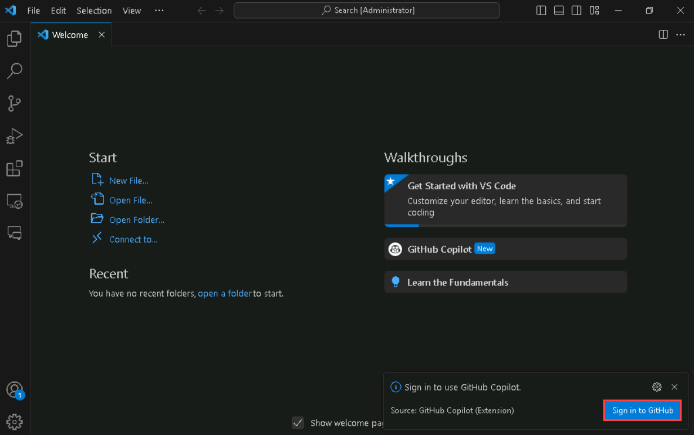

1. Next, once you get the popup, click on **Allow**.

   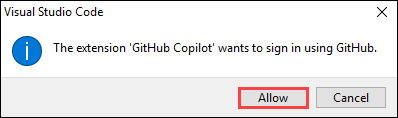

1. In the sign-in to GitHub page in edge browser, enter the **GitHub UserEmail** and **GitHub Password** and click on **Sign in**.

   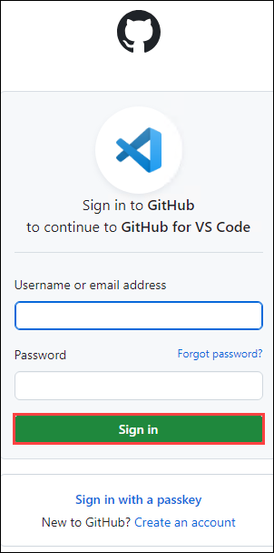

   >**Note:** Navigate to the **Environment** tab to view the key-value pairs of the **GitHub UserEmail**, and **GitHub Password**. You can use the copy buttons under the actions column to have the values copied instantly. Alternatively, it is suggested to have the values copied over onto a notepad for easy accessibility. 

   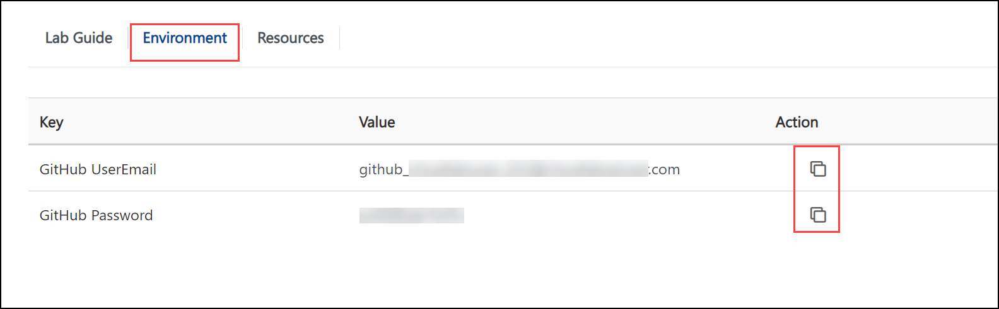

1. Next, to get the authentication code, sign in to Outlook in the Lab VM through an **InPrivate** window (https://outlook.office365.com/mail/)
with the github credentials that were copied over to Notepad in the previous step. After logging into Outlook within the Lab Virtual Machine, locate the most recent email that contains the verification code, and then select **Verify** to return to the login screen.

   >**Note:** The email containing the verification code can sometimes creep into the archive/spam folders within your Outlook.

   

1. Next, click on **Authorize Visual-Studio-Code** to provide additional permissions to GitHub for VS Code on the following page if asked for, as shown in the screenshot below:

   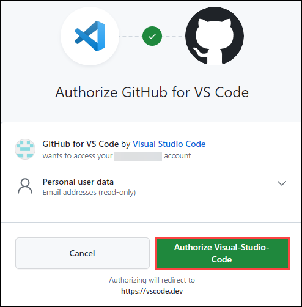

1. You will encounter a pop-up prompt. Click **Open** to proceed.

   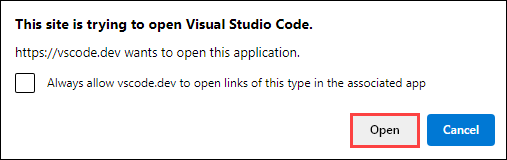
   
   >**Note:** If you get another pop-up stating **Allow an extension to open this URI**, please click on **Open**.

1. You will be able to see in the bottom right corner that Github Copilot has been activated.

   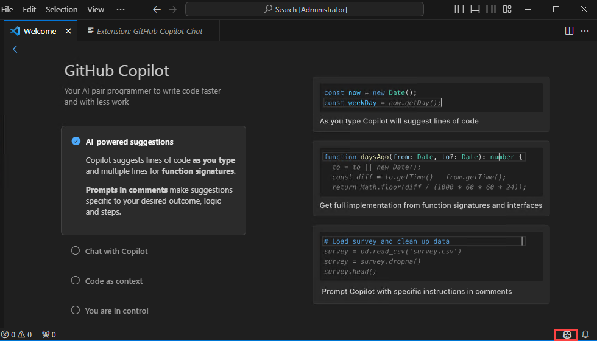

   >**Note:** If the activation status of Github Copilot in the bottom right corner is not visible, try restarting Visual Studio Code to ensure that the activation status becomes visible in that location.

1. Verify if **GitHub Copilot Chat** is installed. If its installed, the below icon should appear in the left navigation pane.
   
    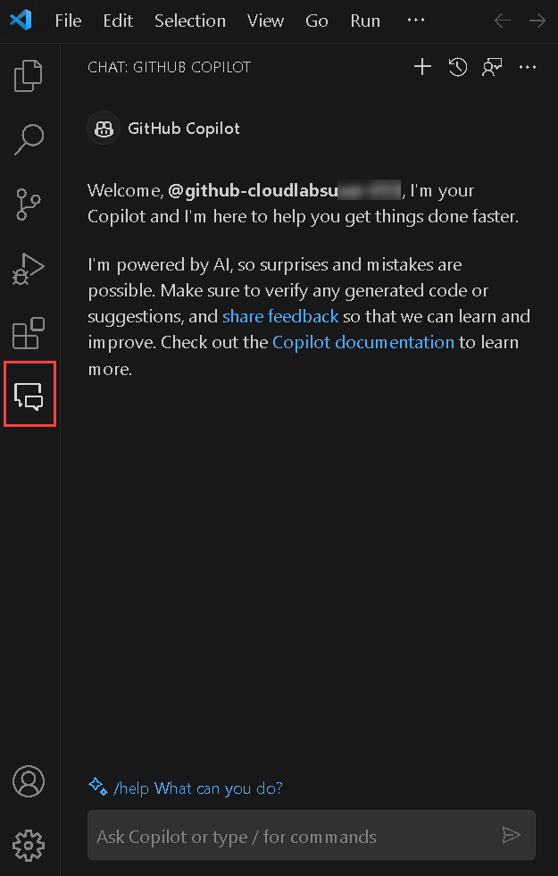
   
### Task 2: Integrate an 'About Us' app component in React using GitHub Copilot

>**NOTE:** It should be noted that the code suggestions offered by GitHub Copilot might not exactly match the screenshots shown within the labguide. GitHub Copilot is an AI-powered tool that generates code based on context and patterns, and its suggestions can be influenced by various factors. It is also important that you have the knowledge on operating and running React Applications which may be needed as you proceed with this exercise.

1. In a new Visual Studio Code window, go to **Explorer (1)** and click on **Open Folder (2)**. Navigate to **C:\Workspaces\lab\DevOps-DevSecOps-Hackathon-lab-files-2/** within the file explorer, and then select the **ContosoTraders.Ui.Website.V2.Raw** folder.

     

2. Ensure to click on **Yes, I trust the authors** within the pop-up to successfully import the CloudLabs folder into VS Code.

   

3. Once the project has loaded, within the explorer pane of VS Code, navigate to `Contosotraders.Ui.Website.V2\src` folder to view the `App.js` file.

   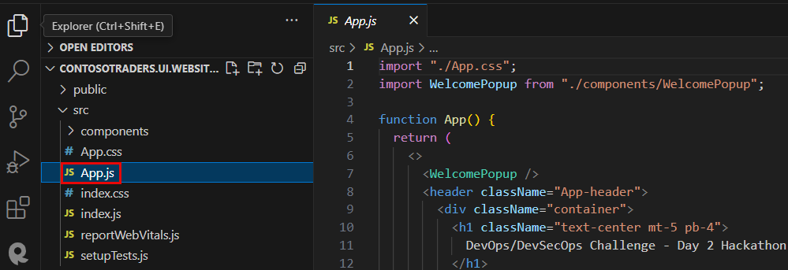

4. Within the **CHAT: GITHUB COPILOT** pane, type: `Help me create the new About Us" page in ContosoTraders.Ui.Website.V2\src` and observe the AI response. You can follow the instructions provided by GitHub Copilot towards successfully adding the About Us page as a part of the sample React application that you have imported into VS Code.

   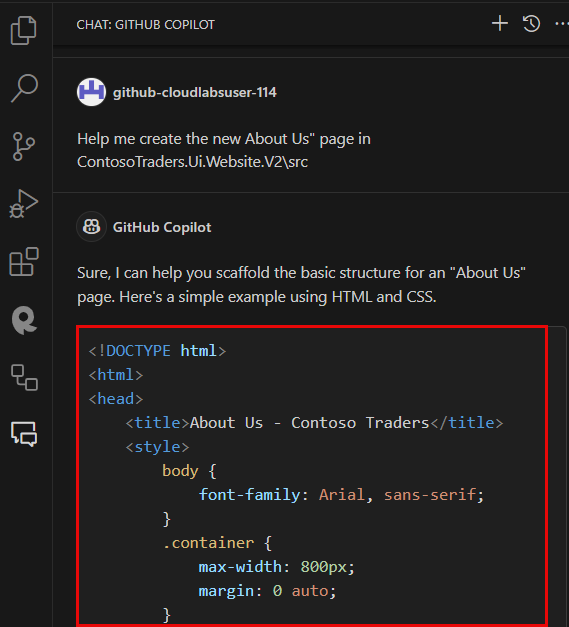

>**Disclaimer:** It should be noted that the code suggestions offered by GitHub Copilot might not exactly match the screenshots shown within the labguide. GitHub Copilot is an AI-powered tool that generates code based on context and patterns, and its suggestions can be influenced by various factors. It is also important that you have the knowledge on operating and running React Applications which may be needed as you proceed with this exercise.

>**Note:** However the ease of executability of this challenge, you can open a new folder within VS Code and import the solution folder from the Windows file explorer with path, `C:\Workspaces\lab\DevOps-DevSecOps-Hackathon-lab-files-2\`. Select the **src** folder. This solution project has integrated "About Us" page and unit test cases for the same.

>**Note:** If you wish to continue to manually edit the raw project, follow the steps from step 6.

5. Create a new file named `AboutUs.css` **(1)** in your `src` directory ie., within the path `ContosoTraders.Ui.Website.V2\src` and then add the following code **(2)**:

   ```
   .about-us {
       padding: 20px;
       font-size: 1.2em;
       line-height: 1.6;
       color: #333;
   }
   
   .about-us h1 {
       font-size: 2em;
       margin-bottom: 0.5em;
   }
   ```

   >**Note:** This `AboutUs.css` file contains CSS (Cascading Style Sheets) rules that are used to style HTML elements on a webpage. The specific code you've selected defines styles for elements with the class `about-us` and `h1` elements within elements with the class `about-us`.

   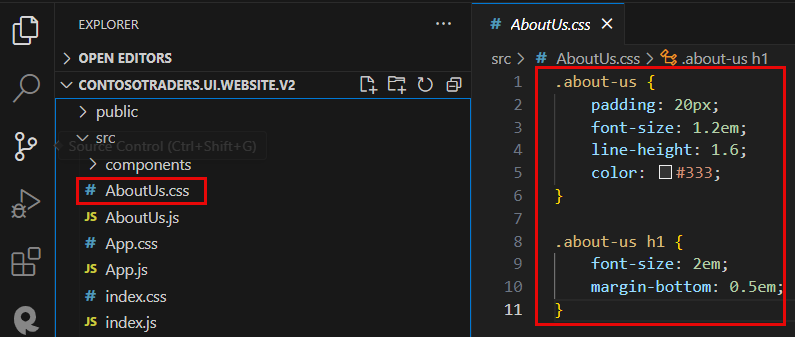

6. Save the newly created `AboutUs.css` file.

7. Now let's build a new component for the application. Create a new file named `AboutUs.js` **(1)** in your `src` directory ie., within the path `ContosoTraders.Ui.Website.V2\src` and then add the following code **(2)**:

   ```
   import React from "react";
   import "./AboutUs.css";
   
   function AboutUs() {
     return (
       <div className="container">
         <div className="about-us">
           <h1 className="text-center">About Us</h1>
           <p>
             Contoso Traders is a leading company in the trading industry. We have
             been serving our customers for over 20 years with high-quality
             products and excellent customer service.
           </p>
           <p>
             Our team is dedicated to providing the best service possible. We value
             our customers and strive to meet their needs.
           </p>
         </div>
       </div>
     );
   }
   
   export default AboutUs;
   ```

   >**Note:** Free free to make changes in the above code snippet as per your use case scenario.

   >**Note:** Notice that the css rules have been imported into the `AboutUs.js` file using the code, `import "./AboutUs.css";`.
   
   >**Note:** The `AboutUs.js` file is a React component that renders an "About Us" section on a webpage based on the CSS rules that have been defined in `AboutUs.css` file.

8. Save the newly created `AboutUs.js` file.

9. Now navigate to the `App.js` file to integrate the "About Us" page that was created in the previous steps.

10. Within the `App.js` file, enter the following code.

   ```
   import AboutUs from "./AboutUs";
   import "./App.css";
   ```

11. Your `App.js` should look similar like the below screenshot:

   

12. Scroll down to the end of the code within the `App.js` file and then add the following code to include the newly created `About Us` component.

   ```
   <AboutUs />
   ```
13. Your `App.js` should now look similar like the below screenshot:

   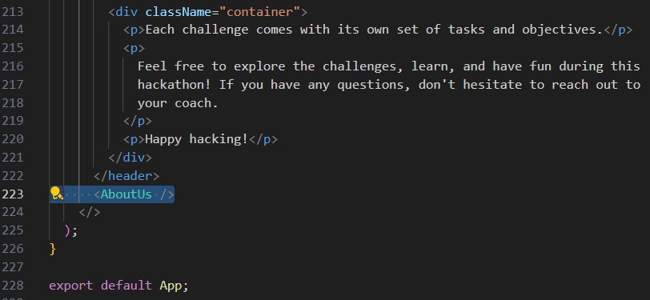

14. To run your React application, you typically use the command line (also known as the terminal). Here are the steps:
      - Within Visual Studio Code, you can open the terminal by going to the top menu to click on **Terminal** **(1)** and then select **New Termimal (2)**.
      - Navigate to your project directory. You can do this with the `cd` command followed by the path to your project. You can use the below command to navigate to the React application's working directory **(3)**:
      ```
      cd C:\Workspaces\lab\DevOps-DevSecOps-Hackathon-lab-files-2\src\ContosoTraders.Ui.Website.V2
      ``` 
      - Once you're in your project directory, you can start the application with the `npm start` **(3)** because we need npm to create the Contoso Traders Application. After running the following command within the terminal, your application should start, and you can view it in your web browser at http://localhost:3000.
        
      ```
      npm run start
      ```
      
   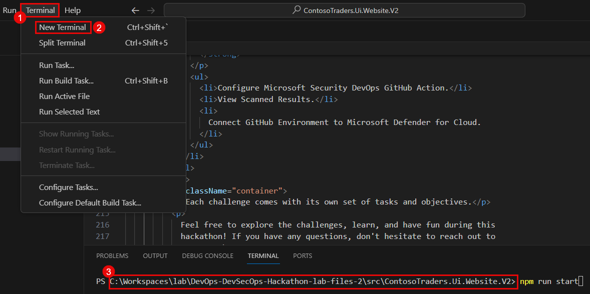

>**Note:** If the above command fails, you might need to run the following command :

   ```powershell
   npm i
   ```
   
   - The command `npm i` is a shorthand version of `npm install`. It is used in Node.js environments to install all the dependencies listed in the `package.json` file. These dependencies are libraries or packages that your project needs to run correctly. The installed packages will be placed in a folder named `node_modules` in your project directory.

   - After the installation of all the dependencies, execute the command - `npm run start` to start the application. This open a new browser tab over the url path, `http://localhost:3000/`.

15. Observe that the new "About Us" component has been added at the end of the webpage.

   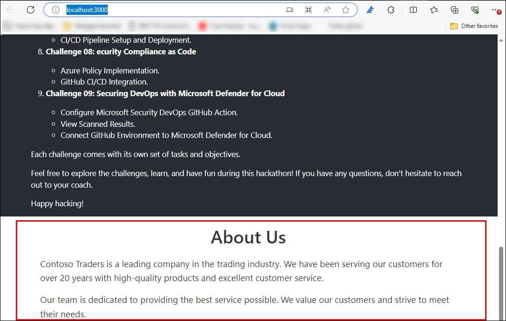

## Exercise 2: Generate and run Unit Test cases using GitHub Coplilot:

### Task 1: Create and run test cases:

1. In Visual Studio Code, go to **Explorer** and navigate to path `ContosoTraders.Ui.Website.V2\src\components` and open the `WelcomePopup.js` file.

   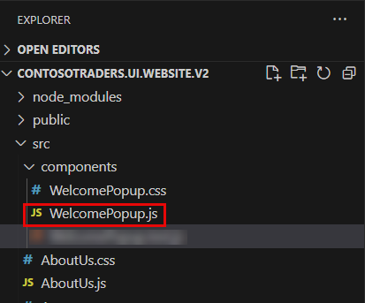

2. Select all code lines `[CTRL+A]` of `WelcomePopup.js` file **(1)** and then paste the following prompt **(2)** within the GitHub Copilot Chat Panel and press enter:
   ```
   /tests
   ```

   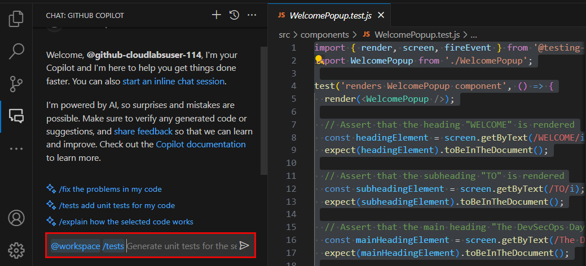

3. Now create a new file named `WelcomePopup.test.js` under the path `ContosoTraders.Ui.Website.V2\src\components`.

   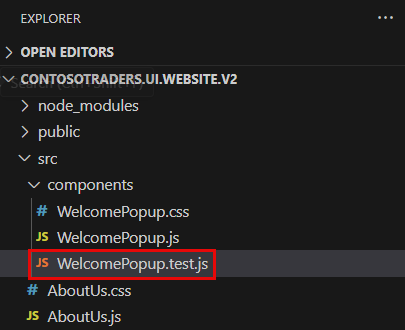

4. Navigate back to the GitHub Copilot chat panel and copy the unit test that has been generated using Copilot for the `WelcomePopup` component. Ensure to paste these unit test cases within the newly created file - `WelcomePopup.test.js` under the `components` folder and save the file.

   **Disclaimer:** Please be aware that the unit test cases produced by GitHub Copilot may not be accurate. There could be issues within the test cases, such as lacking code logic. It's advisable to thoroughly review the generated code before integrating it into your project.

   **Note:** Below is an example unit test cases generated by GitHub Copilot which upon running leads to successful test case passes. This following unit test file is being provided for the easy execution using the `react-app/jest` framework.
   
   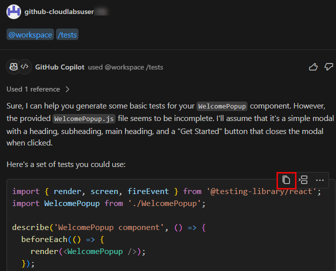

   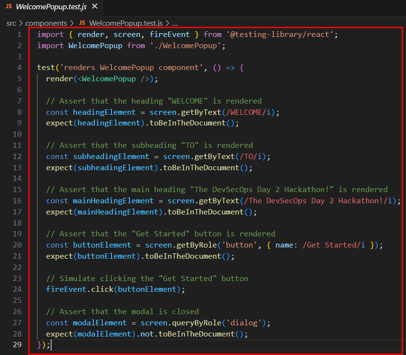

5. Once ready with the test cases, open a new terminal within Visual Studio Code, and navigate to the following path/directory by running the below command within the terminal:

   ```
   cd C:\Workspaces\lab\DevOps-DevSecOps-Hackathon-lab-files-2\src\ContosoTraders.Ui.Website.V2\src\components
   ```

   >**Note:** Ensure that your current working directory within the terminal has the `components` folder in its present path. In this scenario, the `components` folder is present inside the `/src` directory. 

6. To execute the unit test cases genereated by GitHub Copilot, we need to run the `WelcomePopup.test.js` file using the following command within the terminal:

   ```
   npm run test
   ```

7. Post execution of the above unit test, you must ensure to have a successful - `PASS` test runs with no errors. If you are produced with errors, please understand the intricacies of the error as mentioned within the terminal and work towards a successful unit test run.

   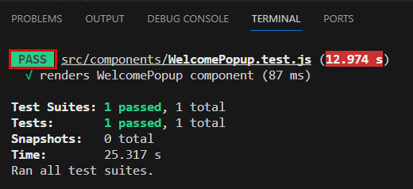

## Exercise 3: Code Review and Security Check

### Task 1: Submit Codebase Modifications to GitHub Repository

1. In a new browser tab, open ```https://www.github.com/login```. From the **Environment Details** page **(1)**, navigate to **License** **(2)** tab and **copy** **(3)** the credentials. Use the same username and password to log into GitHub.

    

2. once logged-in, on the upper-right corner, expand the user **drop-down menu** **(1)** and select **Your repositories** **(2)**.

   

3. Next to the search criteria, locate and select the **New** button.

   

4. On the **Create a new repository** screen, name the repository ```devsecops-2``` **(1)**, select **Public** **(2)**, and click on the **Create repository** **(3)** button.

   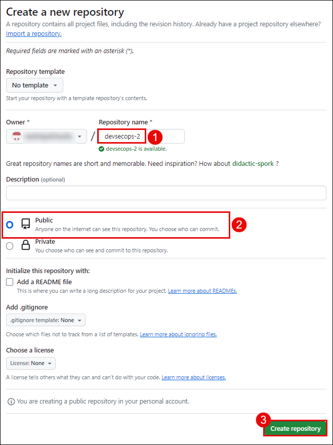 

5. On the **Quick setup** screen, copy the **HTTPS** GitHub URL for your new repository and **save it** in a notepad for future use.

   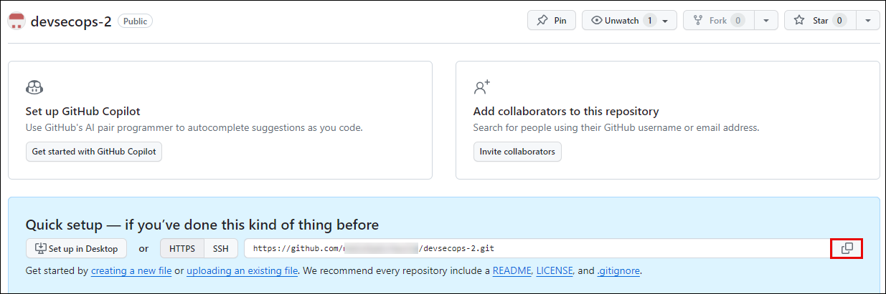

6. From the GitHub username, note down the **Unique-ID** present in the Username. You'll need this in the upcoming steps.

   

7. Navigate back to the **Visual Studio Code** application in which the terminal is already open. In the terminal, click on the **drop-down** button and select **PowerShell** to open a fresh PowerShell terminal tab.

   

8. In Visual Studio Code, run the below commands in the terminal to set your **email** and **username**, which Git uses for commits. Make sure to replace the GitHub account email and username.
   
     ```pwsh
     cd C:\Workspaces\lab\DevOps-DevSecOps-Hackathon-lab-files-2\src\ContosoTraders.Ui.Website.V2
     git config --global user.email "you@example.com"
     git config --global user.name "Your UserName"
     ```
     
    
     
    Run the below-mentioned command in the terminal. Make sure to replace `your_github_repository-url` with the value you copied in step 5 and `Unique-ID` in step 6.

    Note: This step is done to initialize the folder as a Git repository, commit, and submit contents to the remote GitHub branch “main” in the lab files repository created named `devsecops`. 

      ```pwsh
      git init
      git add .
      git commit -m "Initial commit"
      git branch -M main
      git remote add origin<Unique-ID> <your_github_repository-url>
      git push -u origin<Unique-ID> main
      ```
     
   - If you are asked to authenticate your GitHub account, select **Sign in with your browser**, and you will be prompted with a pop-up window to authorize Git Credential Manager. Click on **Authorize git-ecosystem** to provide access.

       
       
   - After you are prompted with the message **Authorization Succeeded**, close the tab and continue with the next task.

### Task 2: Implement Code Scanning and CodeQL

In this task, you'll configure Code scanning and explore CodeQL alerts. Code scanning is a feature that you use to analyze the code in a GitHub repository to find security vulnerabilities and coding errors. Any problems identified by the analysis are shown on GitHub.

**Note**: To perform this task, the GitHub repository should be public. If the repository visibility is private, please go to the settings of the repository and change the visibility to public.

1. Login to GitHub where the `devsecops-2` repository was created.

2. Select the **settings** ***(1)*** tab from the GitHub browser tab. Click on **code security and analysis** ***(2)*** under the security side blade.

     

3. Click on the **Set up** **(1)** button to enable CodeQL analysis, and select the **Advanced** **(2)** option for creating a CodeQL Analysis YAML file.

      

4. Update the workflow name to **codeql-analysis.yml** ***(1)*** and review the yaml file. Select **Commit changes** ***(2)***, then select **Commit directly to the main branch** ***(3)***, and click on **Commit new file** ***(4)***.
  
   

    

5. Navigate to the **Actions** ***(1)*** tab, here you can review the **workflow** ***(2)*** run.
    
    

6. Navigate to the **Security** ***(1)*** tab and click on **View alerts** ***(2)***.
   
   

7. You will be navigated to the **Code scanning** section. You'll be able to visualize the **No code scanning alerts here!**.
   
   

### Task 3: Implement Repository security advisories

In this task, you'll enable Repository security advisories. You can use GitHub Security Advisories to privately discuss, fix, and publish information about security vulnerabilities in your repository. Anyone with admin permissions to a repository can create a security advisory.

1. Navigate to the **Security** ***(1)*** tab, select **Advisories** ***(2)*** from the side blade, and click on **New draft security advisory** ***(3)***.

   

2. In the Open a draft security advisory tab, under the Advisory Details section, provide the following details:

   - Title: **Improper Access Control in devsecops-2/src/App.js** ***(1)***
   - CVE identifier: **Request CVE ID later** ***(2)***
   - Description: **Add** ***(3)*** the below-mentioned details in the description section.
   
   ```
   Impact
   What kind of vulnerability is it? Who is impacted?

   HTTP request handlers should not perform expensive operations such as accessing the file system, executing an operating system command, or interacting with a database without limiting the rate at which requests are accepted. Otherwise, the application becomes vulnerable to denial-of-service attacks where an attacker can cause the application to crash or become unresponsive by issuing a large number of requests at the same time.

   Patches
   Has the problem been patched? What versions should users upgrade to?

   It is patched and rectified the error. Please use 1.2 version

   Workarounds
   Is there a way for users to fix or re../mediate the vulnerability without upgrading?

   // set up rate limiter: maximum of five requests per minute
   var RateLimit = require('express-rate-limit');
   var limiter = new RateLimit({
   windowMs: 1601000, // 1 minute
   max: 5
   });

   // apply rate limiter to all requests
   app.use(limiter);

   Added the above code in app.js

   References
   Are there any links users can visit to find out more?

   https://github.com/OWASP/API-Security/blob/master/2019/en/src/0xa4-lack-of-resources-and-rate-limiting.md
   https://codeql.github.com/codeql-query-help/javascript/js-missing-rate-limiting/
   ```
    
   

3. In the **Affected products** section, provide the following details and click on **Create draft security advisory** ***(7)***   
 
   - Ecosystem: **composer** ***(1)***
   - Package name: **devsecops-2/src/App.js** ***(2)***
   - Affected version: **<1.2** ***(3)***
   - Patched version: **1.2** ***(4)***
   - Severity: **High** ***(5)***
   - Common Weakness Enumerator (CWE): **Improper Access Control (CWE-284)** ***(6)***
  
   

4. Once the security advisory is created, scroll down and click on **start a temporary private fork**. It is used to collaborate on a patch for this advisory.

    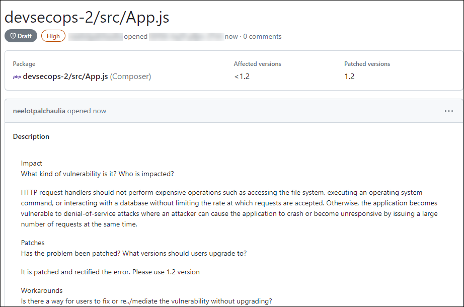
    
    

5. After having the temporary fork, you can request a CVE. It is used for GitHub reviews and published security advisories. Upon review, we may use this advisory to send Dependabot alerts to affected repositories and redistribute the advisory through our API and Atom feed.

## Exercise 4: CI/CD Pipeline Setup and infrastrucure Deployment

### Task 1: Deploy Infrastructure

>**Note:** This exercise is dependent on the completion of Challenge 1 which requires:
   - Updated parameters within `iac/createResources.parameters.json` file.
   - Creation of new Action Secrets named **SERVICEPRINCIPAL**, **SQL_PASSWORD** and **ENVIRONMENT**.
   - Updated resource group name in `iac/createResourceGroup.bicep` file.
   - Updated `RESOURCE_GROUP_NAME` environment variable within `.github/workflow/deploy-infrastructure.yml` file.
   - If you haven't satisfied the above dependencies, start this exercise by following instructions from step 4 (Ignore steps 1, 2 and 3).
 
1. To run the infrastucture deployment workflow created in challenge 1, perform the following steps and wait for the resources to be deployed within your Azure Portal:
      - Click on **Actions (1)** within your GitHub repository.
      - Select the workflow named **contoso-traders-provisioning-deployment (2)**.
      - Click on **Run workflow (3)**.
      - Finally, click on **Run workflow (4)**. Ensure that the branch is selected as **main**.

      

2. Navigate to `.github/workflow/update-contoso-traders-App.yml` path, ensure to update the `AKS_NODES_RESOURCE_GROUP_NAME` and`RESOURCE_GROUP_NAME` environment variable by replacing `<deployment-id>` with **<inject key="DeploymentID" enableCopy="false" />**.

    

3. To update the application, run the workflow by performing the following steps and wait for the resources to be deployed within your azure portal:
      - Click on **Actions (1)** within your GitHub repository.
      - Select on the workflow named **update contoso traders app (2)**.
      - Click on **Run workflow (3)**.
      - Finally click on **Run workflow (4)**. Ensure that the branch is select as **main**.

     

4. Within the GitHub repository, navigate to the `iac/createResources.parameters.json` path and update the value of the following parameters:
   - Replace `deploymentidvalue` with **<inject key="DeploymentID" enableCopy="false" /> (1)**.
   - Replace `bicepsqlpass` value with **<inject key="AzureAdUserPassword"></inject> (2)**.
  
       

5. To create GitHub secrets, in your GitHub lab files repository, click on the **Settings** tab.

      

6. Navigate to **Environment Details** **(1)**, click on **Service Principal Details** **(2)**, and copy the **Subscription ID**, **Tenant ID (Directory ID)**, **Application ID (Client ID)**, and **Secret Key (Client Secret)**.

      
   
      - Replace the values that you copied in the below JSON. You will be using them in this step.
      
      ```json
      {
         "clientId": "zzzzzzzz-zzzz-zzzz-zzzz-zzzzzzzzzzzz",
         "clientSecret": "zzzzzzzzzzzzzzzzzzzzzzzzzzzzzzzzzzzzzzzz",
         "tenantId": "zzzzzzzz-zzzz-zzzz-zzzz-zzzzzzzzzzzz",
         "subscriptionId": "zzzzzzzz-zzzz-zzzz-zzzz-zzzzzzzzzzzz"
      }
      ```

7. Under **Security**, expand **Secrets and variables** **(1)** by clicking the drop-down and select **Actions** **(2)** blade from the left navigation bar. Select the **New repository secret** **(3)** button.

   

8. Under the **Actions Secrets/New secret** page, enter the below-mentioned details and click on **Add secret** **(3)**.

   - **Name** : Enter **SERVICEPRINCIPAL** **(1)**
   - **Value** : Paste the service principal details in JSON format **(2)**
   
   

9. To create another secret, under the **Actions Secrets/New secret** page, enter the below-mentioned details and click on **Add secret** ***(3)***.

   - **Name**: Enter **SQL_PASSWORD** ***(1)***
   - **Value**: Enter **<inject key="AzureAdUserPassword"></inject> (2)**, which would be the same as the Azure AD Password.

   

10. Under the **Actions Secrets/New secret** page, enter the below-mentioned details and click on **Add secret** ***(3)***.

   - **Name** : Enter **ENVIRONMENT** ***(1)***
   - **Value** : **<inject key="DeploymentID" enableCopy="false" />** (Copy the Deployment ID from the environment details tab) ***(2)***
   
   

11. Now within the GitHub repository, navigate to the `iac/createResourceGroup.bicep` path and update the resource group name as mentioned below:
   - Replace `<deployment-id>` with **<inject key="DeploymentID" enableCopy="false" />**.

   

12. Navigate to the `.github/workflow/deploy-infrastructure.yml` path and ensure to update the `RESOURCE_GROUP_NAME` environment variable by replacing `<deployment-id>` with **<inject key="DeploymentID" enableCopy="false" />**.

   

13. To run a workflow, perform the following steps and wait for the resources to be deployed within your Azure Portal:
      - Click on **Actions (1)** within your GitHub repository.
      - Select the workflow named **contoso-traders-provisioning-deployment (2)**.
      - Click on **Run workflow (3)**.
      - Finally, click on **Run workflow (4)**. Ensure that the branch is selected as **main**.

      

14. Navigate to `.github/workflow/update-contoso-traders-App.yml` path, ensure to update the `AKS_NODES_RESOURCE_GROUP_NAME` and`RESOURCE_GROUP_NAME` environment variable by replacing `<deployment-id>` with **<inject key="DeploymentID" enableCopy="false" />**.

    

15. To run a workflow, perform the following steps and wait for the resources to be deployed within your azure portal:
      - Click on **Actions (1)** within your GitHub repository.
      - Select on the workflow named **update contoso traders app (2)**.
      - Click on **Run workflow (3)**.
      - Finally click on **Run workflow (4)**. Ensure that the branch is select as **main**.

     

### Task 2: Setup CI/CD Workflow

1.  From the Azure Portal Dashboard, click on Resource Groups from the Navigate panel to see the resource groups.

    
   
1. Select the **contosotraders-<Deployment-ID>** resource group from the list.

     
   
1. Select the **productsdb** SQL database from the list of resources.

    
   
1. Under the Settings side blade, select **Connection strings** ***(1)*** and copy the **ADO.NET (SQL authentication)** ***(2)*** connection string from the ADO.NET tab. 

     
 
1. In your GitHub lab files repository, select the **Settings** tab from the lab files repository.

   
   
1. Under **Security**, expand **Secrets and variables** ***(1)*** by clicking the drop-down and selecting **Actions** ***(2)*** from the left navigation bar. Select the edit button for the created secret named **SQL_PASSWORD** ***(3)***.

   
    
1. Under the **Actions Secrets/Update secret** page, enter the below-mentioned details, and click on **Update secret** ***(3)***.

   - **Value**: Paste the **ADO.NET (SQL authentication)** that you  have copied in the previous step.
   
   
   
   >**Note**: Replace `{your_password}` with the ODL User Azure Password. Go to **Environment Details (1)**, click on **Azure credentials (2)**, and copy **Password (3)**.
   
      
   
1. From your GitHub repository, select the **Actions** ***(1)*** tab. Select the **contoso-traders-app-deployment** ***(2)*** workflow from the side blade, Click on the  **drop-down** ***(3)*** next Run workflow button, and select **Run workflow** ***(4)***.

   
   
1. Navigate back to the Actions tab and select the **contoso-traders-app-deployment** workflow. This workflow builds the Docker image, which is pushed to the container registry. The same image is pushed to the Azure container application.

   
   
   

### Task 3: Test the application

1. Navigate to Azure Portal, and click on Resource Groups from the Navigate panel to see the resource groups.

    
   
2. Select the **contosotraders-<inject key="DeploymentID" enableCopy="false" />** resource group from the list.

    
   
3. Select the **contosotraders-ui2<inject key="DeploymentID" enableCopy="false" />** endpoint from the list of resources.

    
   
4. Click on the **Endpoint hostname**. It'll open a browser tab where you will be able to verify that the Contoso Traders app has been hosted successfully.

    
    
    

## Success criteria:
To complete this challenge successfully:

- Successful implementation of the new feature.
- Accuracy and completeness of the generated unit tests with all successful passes.
- Successful setup and execution of the CI/CD pipeline.

## Additional Resources:

- Refer to [About GitHub Copilot Chat](https://docs.github.com/en/copilot/github-copilot-chat/about-github-copilot-chat) for reference.
- Refer to [Copilot Chat writes Unit Tests](https://dev.to/this-is-learning/copilot-chat-writes-unit-tests-for-you-1c82) for reference.
- Refer to [Using GitHub Copilot Chat in your IDE](https://docs.github.com/en/copilot/github-copilot-chat/using-github-copilot-chat-in-your-ide) for reference.
