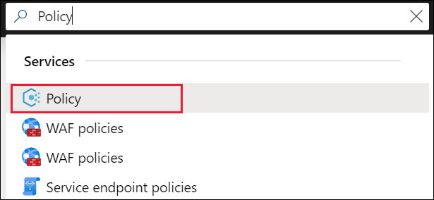
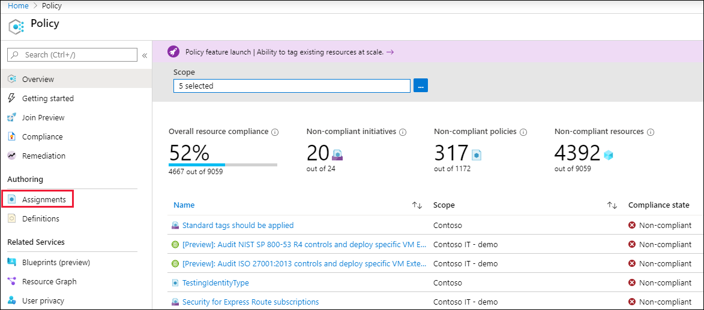
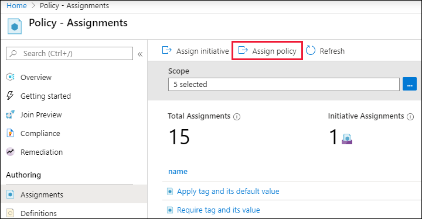
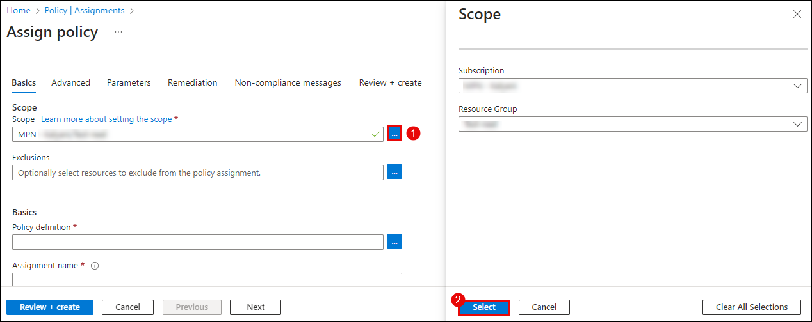
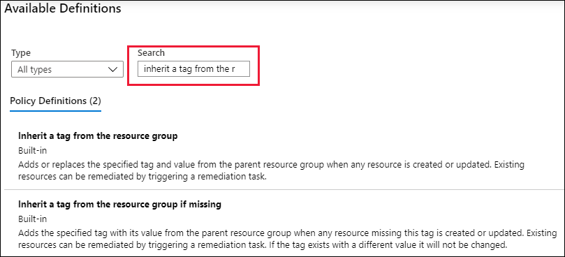
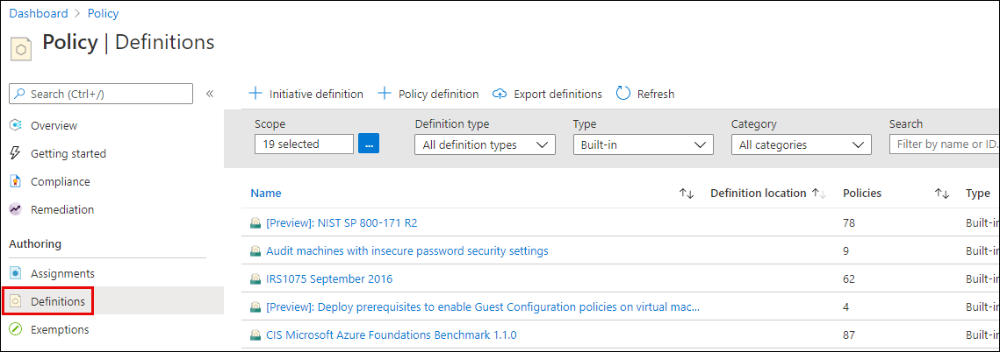
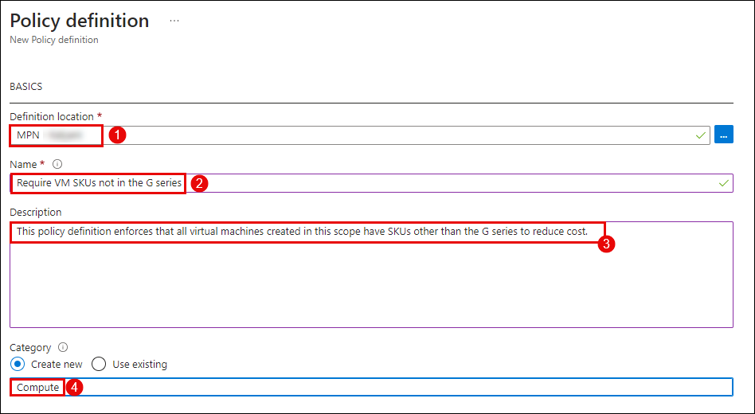
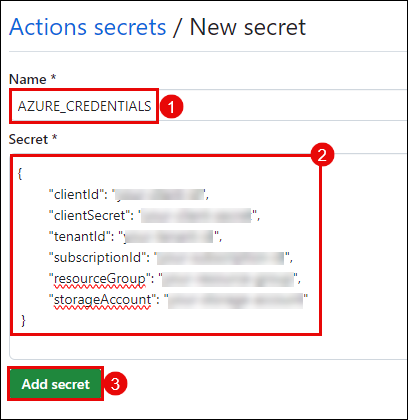
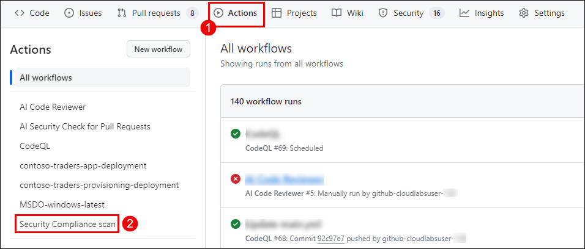

# Challenge 08: Security Compliance as Code

## Introduction

In this challenge, you are a DevOps engineer responsible for ensuring the security compliance of your organization's Azure resources. Your task is to implement and enforce security policies using Azure Policy over the Azure resources and integrate compliance scanning into the GitHub CI/CD pipelines for your Azure projects.

This is the solution guide, which provides all the specific, step-by-step directions needed to do the task.

## Solution Guide

## Exercise 1: Implement Security Policies using Azure Policy

### Task 1: Assign a Built-In policy

In this task, you will enforse compliance with Azure Policy by assigning a policy definition. A policy definition defines under what condition a policy is enforced and what effect to take. In this solution, you will assign the built-in policy definition called **Inherit a tag from the resource group if missing** to add the specified tag with its value from the parent resource group to new or updated resources missing the tag and then implement a new custom policy for the resources that have been deployed with the specific SKU's.

1. Go to the Azure portal to assign policies. Search for and select **Policy**.

   

2. Select **Assignments** on the left side of the Azure Policy page. An assignment is a policy that has been assigned to take place within a specific scope.

   

3. Select **Assign Policy** from the top of the **Policy - Assignments** page.

   

4. On the **Assign Policy** page and **Basics** tab, perform the following steps:
   - Select the **Scope** by selecting the ellipsis and selecting either a management group or subscription **(1)**. Optionally, select a resource group. A scope determines what resources or grouping of resources the policy assignment gets enforced on.
   - Click on **Select** at the bottom of the Scope pane **(2)**.

   

5. Resources can be excluded based on the **Scope**. **Exclusions** start at one level lower than the level of the **Scope**. **Exclusions** are optional, so leave it blank for now.

6. Select the **Policy definition** ellipsis to open the list of available definitions. You can filter the policy definition Type to Built-in to view all and read their descriptions.

7. Select **Inherit a tag from the resource group if missing**. If you can't find it right away, type **inherit a tag** into the search box and then press ENTER or select out of the search box. Click on **Select** at the bottom of the **Available Definitions** page once you have found and selected the policy definition.

   

8. The **Assignment name** is automatically populated with the policy name you selected, but you can change it. For this example, leave **Inherit a tag from the resource group if missing**. You can also add an optional **Description**. The description provides details about this policy assignment.

9. Leave **Policy enforcement** as **Enabled**. When Disabled, this setting allows testing the outcome of the policy without triggering the effect.

10. **Assigned by** is automatically filled based on who is logged in. This field is optional, so custom values can be entered.

11. Select the **Parameters** tab at the top of the wizard.

12. For **Tag Name**, enter **Environment**.

13. Select the **Remediation** tab at the top of the wizard.

14. Leave **Create a remediation task** unchecked. This box allows you to create a task to alter existing resources in addition to new or updated resources.

15. **Create a Managed Identity** is automatically checked since this policy definition uses the modify effect. **Permissions** is set to Contributor automatically based on the policy definition.

16. Select the **Non-compliance messages** tab at the top of the wizard.

17. Set the **Non-compliance message** to **This resource doesn't have the required tag**. This custom message is displayed when a resource is denied or for non-compliant resources during regular evaluation.

18. Select the **Review + create** tab at the top of the wizard.

19. Review your selections, then select **Create** at the bottom of the page.

### Task 2: Implement a new custom policy

Now that you've assigned a built-in policy definition, you can do more with Azure Policy. Next, create a new custom policy to save costs by validating that virtual machines created in your environment can't be in the G series. This way, every time a user in your organization tries to create a virtual machine in the G series, the request is denied.

1. Select **Definitions** under **Authoring** in the left side of the Azure Policy page.

   

2. Select **+ Policy definition** at the top of the page. This button opens to the **Policy definition** page and enter the following information:
   - Select the **Definition location** **(1)** by selecting the ellipsis and selecting a subscription. Optionally, select a resource group. A scope determines what resources or grouping of resources the policy assignment gets enforced on.
   - **Name:** Require VM SKUs not in the G series. **(2)**
   - **Description:** This policy definition enforces that all virtual machines created in this scope have SKUs other than the G series to reduce cost. **(3)**
   - **Category:** Create a new catrgory named **Compute**.  **(4)**

   

3. Copy the following JSON code and then update it for your needs with:

   - The policy parameters.
   - The policy rules/conditions, in this case - VM SKU size equal to G series
   - The policy effect, in this case - **Deny**.

   ```
   {
       "policyRule": {
           "if": {
               "allOf": [{
                       "field": "type",
                       "equals": "Microsoft.Compute/virtualMachines"
                   },
                   {
                       "field": "Microsoft.Compute/virtualMachines/sku.name",
                       "like": "Standard_G*"
                   }
               ]
           },
           "then": {
               "effect": "deny"
           }
       }
   }
   ```

   >**Note:** The **field** property in the policy rule must be a supported value. An example of an alias might be `Microsoft.Compute/VirtualMachines/Size`.

## Exercise 2: Integrate Compliance Scanning in CI/CD pipeline

### Task 1: Create a GitHub Secret

1. To create GitHub secrets, in your GitHub lab files repository, click on the **Settings** tab.

      

2. Navigate to **Environment Details** **(1)** tab of the integrated lab environment, click on **Service Principal Details** **(2)**, and copy the **Subscription ID**, **Tenant ID (Directory ID)**, **Application ID (Client ID)**, and **Secret Key (Client Secret)**.

      
   
      - Replace the values that you copied in the below JSON. You will be using them in this step.
      
      ```json
      {
        "clientId": "your-client-id",
        "clientSecret": "your-client-secret",
        "tenantId": "your-tenant-id",
        "subscriptionId": "your-subscription-id",
        "resourceGroup": "your-resource-group"
      }
      ```

   >**Note:** Also ensure to replace `your-subscription-id` and `your-resource-group` within the above secret.

3. Within GitHub, under **Security**, expand **Secrets and variables** **(1)** by clicking the drop-down and select **Actions** **(2)** blade from the left navigation bar. Select the **New repository secret** **(3)** button.

   

4. Under the **Actions Secrets/New secret** page, enter the below-mentioned details and click on **Add secret** **(3)**.

   - **Name** : Enter **AZURE_CREDENTIALS** **(1)**
   - **Secret** : Paste the service principal details in JSON format **(2)**
   - Click on **Add Secret (3)**
   
   

### Task 2: Implement Azure Policy Compliance Scan

1. In a new browser tab, open ```https://www.github.com/login```. From the **Environment Details** page **(1)**, navigate to **License** **(2)** tab and **copy** **(3)** the credentials. Use the same username and password to log into GitHub.

    

2. once logged-in, on the upper-right corner, expand the user **drop-down menu** **(1)** and select **Your repositories** **(2)**.

   

3. Select the repository that you created earlier named, `devsecops`.

   

4. Within a new browser tab, navigate to `https://github.com/marketplace/actions/azure-policy-compliance-scan` to view the **Azure Policy Compliance Scan** GitHub Action from the GitHub MarketPlcae.

5. Go back to your `devsecops` GitHub repository.

6. Navigate to `.github/workflows` directory and create a new file named `complaince-scan.yml`.

7. Paste the following code within the workflow file. The below workflow will trigger a policy compliance scan on the resource group. After the scan is complete, it will fetch the compliance state of resources. The action will fail if there are any non-compliant resources.

   ```
   # File: .github/workflows/workflow.yml

   on: push
   
   jobs:
     assess-policy-compliance:    
       runs-on: ubuntu-latest
       steps:
       # Azure Login       
       - name: Login to Azure
         uses: azure/login@v1
         with:
           creds: ${{secrets.AZURE_CREDENTIALS}} 
       
       - name: Check for resource compliance
         uses: azure/policy-compliance-scan@v0
         with:
           scopes: |
             /subscriptions/xxxxxxxx-xxxx-xxxx-xxxx-xxxxxxxxxxxx/resourceGroups/<resource-group-name>               
           scopes-ignore: |
             /subscriptions/xxxxxxxx-xxxx-xxxx-xxxx-xxxxxxxxxxxx/resourceGroups/<resource-group-name/providers/<resource-provider-name>
        
   ```

   >**Note:** Ensure to Replace the **Subscription ID** and **<resource-group-name** and **<resource-provider-name>** in the above code.

8. Commit the changes within your repository to successfully create the workflow file.

9. Head back to the **GitHub Actions (1)** tab and then select the Action named **Security Complainace Scan (2)**.

   

10. Make sure all the workflow runs are successful.

## Success criteria:
To complete this challenge successfully:

- Successful effectiveness of policies in enforcing security compliance.
- Successful integration of compliance scanning into the pipeline.
- Successful setup and execution of the CI/CD pipeline.

## Additional Resources:

- Refer to [Overview of Azure Policy](https://learn.microsoft.com/en-us/azure/governance/policy/overview) for reference.
- Refer to [Azure Policy Compliance Scan](https://github.com/marketplace/actions/azure-policy-compliance-scan) for reference.
