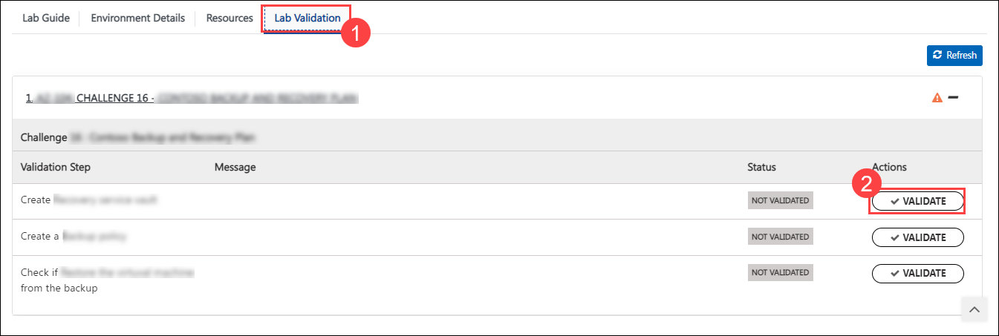
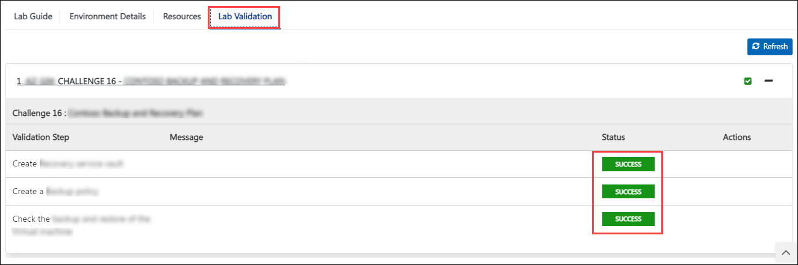
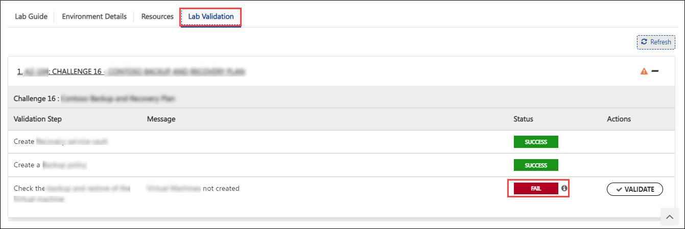
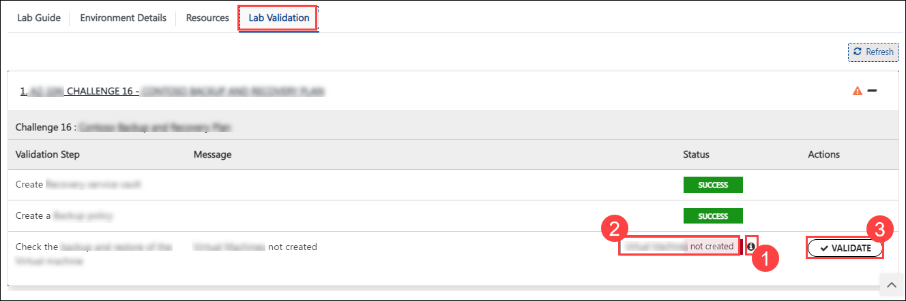

# Challenge 01: Continuous Integration and Deployment for Contoso Traders using GitHub Actions

### Estimated Time: 90 minutes

## Introduction:
This challenge is designed to evaluate your skills in creating a robust CI/CD pipeline leveraging GitHub Actions. It aims to assess your capability to not only establish a seamless pipeline but also to guarantee the successful deployment of the application.

You are a DevOps engineer tasked with setting up a robust Continuous Integration and Continuous Deployment (CI/CD) pipeline for an e-commerce application named Contoso Traders. The goal is to set up a GitHub repository, implement a CI/CD workflow using GitHub Actions, deploy the application to Azure, and make rolling updates to the repository.

## Accessing GitHub

1. To access and login to GitHub, open the Edge browser from inside the environment and navigate to **[GitHub](https://github.com/)**.

2. Sign in to GitHub by clicking on the **Sign in** button in the top right corner of the GitHub home page.

3. On the **Sign into GitHub tab**, you will see a login screen. Enter the following email/username, and click on **Next**.

   - **Email/Username:** <inject key="GitHubUsername"></inject>

1. Now enter the following password and click on **Sign in**.

   - **Password:** <inject key="GitHubPassword"></inject>

## Accessing the Azure Portal

1. To access the Azure Portal, open the Edge browser from inside the environment and navigate to **[Azure Portal](https://portal.azure.com)**.

1. On the **Sign in to Microsoft Azure** tab, you will see a login screen. Enter the following email/username and then click on **Next**. 

   * Email/Username: <inject key="AzureAdUserEmail"></inject>
        
1. Now enter the following password and click on **Sign in**.

   * Password: <inject key="AzureAdUserPassword"></inject>
     
1. If you see the pop-up **Stay Signed in?**, click No.

1. If you see the pop-up **You have free Azure Advisor recommendations!**, close the window to continue the lab.

1. If a **Welcome to Microsoft Azure** pop-up window appears, click **Maybe Later** to skip the tour.

## Challenge Objectives:

>**Note:** Only use GitHub and GitHub Actions for CI/CD; no usage of Azure DevOps or any external CI/CD services.

1. **Setup a GitHub repository:**

   - Create a new GitHub repository with public access permission.
   - You are provided with an e-commerce application named Contoso Traders, which needs to be deployed and hosted on Azure.
   - You can navigate to the `C:\Workspaces\lab\DevOps-DevSecOps-Hackathon-lab-files` directory and find the complete code base of the application.
   - Using Visual Studio code, connect to the GitHub repository that you created in the earlier step and push the application code base to your GitHub repository.

2. **Deploy Infrastructure:**

   - In the GitHub repository, navigate to the `iac/createResources.parameters.json` path and update the value of the following parameters.

     - Replace `deploymentidvalue` with **<inject key="DeploymentID" enableCopy="false" />**.

     - Replace `bicepsqlpass` value with **<inject key="AzureAdUserPassword"></inject>**.

     - Create GitHub secrets with the same name as mentioned below.

        - **SERVICEPRINCIPAL**: Create a secret to store service principal details. You can find the details in the Environment details tab of your environment.
          
    
        > **Hint:** Use the following format to store service principal details
   
        ```json
         {
            "clientId": "zzzzzzzz-zzzz-zzzz-zzzz-zzzzzzzzzzzz",
            "clientSecret": "zzzzzzzzzzzzzzzzzzzzzzzzzzzzzzzzzzzzzzzz",
            "tenantId": "zzzzzzzz-zzzz-zzzz-zzzz-zzzzzzzzzzzz",
            "subscriptionId": "zzzzzzzz-zzzz-zzzz-zzzz-zzzzzzzzzzzz"
         }
        ```

        - **SQL_PASSWORD**: You need to store **<inject key="AzureAdUserPassword"></inject>(Azure AD user password)** as a secret.
        
        - **ENVIRONMENT**: Create a secret to store the deployment ID which is **<inject key="DeploymentID" enableCopy="false" />**.
       
       >**Hint**: You can also find the deployment ID and the Azure AD password within the environment details tab of your integrated lab guide.

   - In the GitHub repository, navigate to the `iac/createResourceGroup.bicep` path and update the resource group name as mentioned below:
   
      - Replace `<deployment-id>` with **<inject key="DeploymentID" enableCopy="false" />**.

   - Within your repository, navigate to `.github/workflow/deploy-infrastructure.yml` path and ensure to update the `RESOURCE_GROUP_NAME` environment variable by replacing `<deployment-id>` with **<inject key="DeploymentID" enableCopy="false" />**.
     
   - Within your repository, navigate to `.github/workflow/Update-contoso-Traders-App.yml` path, ensure to update the `RESOURCE_GROUP_NAME`, and `AKS_NODES_RESOURCE_GROUP_NAME` environment variable by replacing `<deployment-id>` with **<inject key="DeploymentID" enableCopy="false" />**.
   
   -  Run the workflow named `contoso-traders-provisioning-deployment` and `update contoso Traders app`, using GitHub Actions.
   
   -  Run the workflow named `contoso-traders-provisioning-deployment` using GitHub Actions.
   
3. **Setup CI/CD Workflow:**

   - Update the previously created GitHub secret with the following value:
     
      - **SQL_PASSWORD**: ADO.NET (SQL authentication) connection string of `productsdb` SQL database.

   > **Hint**: You can also find the `productsdb` SQL database in the Azure portal.

   - In the GitHub repository, navigate to  **.github/workflow** where you will be able to find the yaml workflow. This YAML file is partially updated, you need to update the YAML files with the right steps and complete the workflow. This workflow should deploy the application to Azure. 
  
4. **Test the application and perform rolling updates:**
   
   - Navigate to the Azure Portal and check the application status using Azure Endpoint.
   - Update the workflow file to initiate an Action run on changes to the GitHub repository.
  
## Success criteria:
To complete this challenge successfully:

- Verify the successful deployment of the Infrastructure of the application in the Azure Portal.
- Verify the GitHub Action; all the jobs in the GitHub Action should be completed without any error.
- Verify the deployment and hosting of the Contoso Traders application in Azure.

## Additional Resources:

Here are a few documentation and guides to assist you in completing the challenge.
- [GitHub Actions](https://docs.github.com/en/actions)
- [Why CI/CD](https://resources.github.com/ci-cd/).
- [Continuous Deployment with Github Actions: An Example](https://www.dolthub.com/blog/2020-11-23-continous-deployment-with-github-actions/).
- [How to build a CI/CD pipeline with GitHub Actions in four simple steps](https://github.blog/2022-02-02-build-ci-cd-pipeline-github-actions-four-steps/).

## Challenge Validations:

1. After completing the challenge, you need to visit the **Lab Validation (1)** tab and click on the **VALIDATE (2)** button under Actions to perform the validation steps. Verify that you have met the success criteria of the challenge. 
 
    
 
1. If the validation status displays **Success** for all the validation steps, **congratulations!** This means that you have completed the challenge.
 
     
1. If the validation status displays **Fail**, **don't worry!** This could mean that you did not perform the challenge correctly.
 
     
 
1. Hover your mouse over the `i` **(1)** icon to see the error message and determine the root cause of the failure. Based on the error message, revisit the challenge as necessary, and redo the validation by clicking on the **VALIDATE (3)** button again.
     
 
1. If you are still having trouble, you can reach out to the support team via `labs-support@spektrasystems.com` for further assistance. The support team is available to help you troubleshoot and resolve any technical issues or validation issues that may arise while the lab environment is live.

## Conclusion:
Congratulations on completing the **Continuous Integration and Deployment for Contoso Traders using GitHub Actions** challenge. You have successfully verified the configuration of a GitHub repository, established a functional CI/CD workflow, and utilized GitHub Actions to deploy the .NET application. In the next challenge, you will look into implementing security features offered by GitHub.
